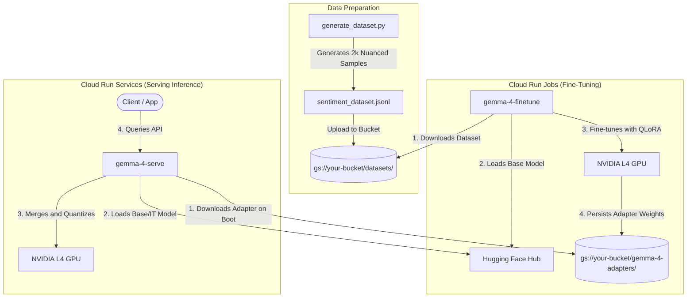

# Gemma 4 Fine-Tuning & Serving on Cloud Run (L4 GPU)

This repository contains a production-grade, end-to-end framework for fine-tuning and serving Google's **Gemma 4 (Edge 4B)** model on **Google Cloud Run** using NVIDIA L4 GPUs.

---

## 🏗️ Project Architecture & Components

```
/Users/ksprashanth/code/sandbox/gemma4-finetuning/
├── train.py                  # Fine-tuning script supporting QLoRA & GCS integration
├── serve.py                  # FastAPI inference server with dynamic GCS adapter loading
├── generate_dataset.py       # Programmatic generator for nuanced sentiment analysis data
├── requirements.txt          # Shared Python dependencies
├── Dockerfile.train          # Container specification for Cloud Run Job (Fine-tuning)
├── Dockerfile.serve          # Container specification for Cloud Run Service (Inference)
├── job.yaml                  # Declarative spec for Cloud Run Job
├── service.yaml              # Declarative spec for Cloud Run Service
├── test_client.py            # CLI test client for raw and chat completion endpoints
├── create_colab_notebook.py  # Script to compile the companion Jupyter notebook
├── gemma4_colab_finetuning.ipynb # Interactive, OOM-safe companion notebook for Colab testing
└── README.md                 # This comprehensive architecture & operational guide
```

---

## 🔄 End-to-End Data Flow



---

## 🎭 Model Behavioral Comparison (IT vs Base vs Fine-Tuned)

This table demonstrates the exact difference in output behaviors when given the **same input instruction** across the three model variants:

| Model Variant | Expected Behavior | Example Output | Linguistic Reason |
| :--- | :--- | :--- | :--- |
| **Instruction-Tuned (IT)**<br>`google/gemma-4-E4B-it` | **Task Aligned Helper**<br>Understands conversational framing, targets system prompts, and responds succinctly. | `Positive` | It has been aligned using **Supervised Fine-Tuning (SFT)** and RLHF to identify conversational markers (e.g. user-assistant templates) and output task compliance. |
| **Base Model**<br>`google/gemma-4-E4B` | **Raw Statistical Autocomplete**<br>Ignores the command and treats the prompt as the start of a document, continuing to list reviews or templates. | `Classify the sentiment: 'The software has a steep learning curve, but it is absolutely brilliant!'`<br>`Classify the sentiment: 'Bad battery.'`<br>`Classify the sentiment: 'Excellent stay.'` | It acts as a **high-entropy token completer**. It only knows how to continue the statistical pattern of the input text, not how to follow an instruction. |
| **Fine-Tuned Model**<br>`Base Model + Sentiment Adapter` | **Domain Aligned Specialist**<br>Constrains its high-entropy autocomplete states to output *only* your target sentiment label. | `Positive` | QLoRA backpropagation updated the adapter's linear projection layers, steering attention heads to emit only the targeted classification tokens when prompted with the instruction template. |

---

## 📦 Prerequisites & Initial Setup

Before deploying, ensure you have:
1. Approved access to **Gemma 4** on the Hugging Face Hub:
   - Base Model: [google/gemma-4-E4B](https://huggingface.co/google/gemma-4-E4B)
   - Instruction-Tuned (IT) Model: [google/gemma-4-E4B-it](https://huggingface.co/google/gemma-4-E4B-it)
2. Generated a Hugging Face read-access token (`HF_TOKEN`) from [Settings](https://huggingface.co/settings/tokens).
3. Configured `gcloud` pointing to your active Google Cloud project:
   ```bash
   gcloud config set project YOUR_PROJECT_ID
   gcloud services enable run.googleapis.com artifactregistry.googleapis.com secretmanager.googleapis.com storage.googleapis.com
   ```

---

## 📊 Step 1: Dataset Generation & GCS Upload

You have two powerful pathways to prepare your training dataset:
* **Pathway A (Starter):** Run a local programmatic script to generate synthetic sentiment data.
* **Pathway B (Recommended & Production-Scale):** Leverage **Google Antigravity (AGY)** to agentically generate highly varied, diverse, and robust datasets across a range of domain-specific use cases.

---

### Pathway A: Local Programmatic Script
We have provided a programmatic generator to compile highly-nuanced sentiment analysis data. It outputs exactly 2,000 unique records covering linguistic edge-cases (double negations, sarcasm, slang, mixed-sentiments, emojis, and typos):
```bash
python generate_dataset.py
```
This writes the dataset locally to `sentiment_dataset.jsonl` matching Gemma's conversational training schema:
```json
{
  "messages": [
    {"role": "user", "content": "Classify the sentiment: 'The software has a steep learning curve, but it is absolutely brilliant!'"},
    {"role": "model", "content": "Positive"}
  ]
}
```

---

### Pathway B: Agentic Synthesis with Google Antigravity (AGY)
> [!TIP]
> Programmatic scripts use pre-defined templates, which limits vocabulary diversity and semantic range. For production-grade fine-tuning, you need high-fidelity synthetic data. By using the **AGY CLI (`agy`)** or **Antigravity 2.0 Desktop app**, you can command the AI to act as a **Producer Archetype** to generate thousands of unique, natural, and complex samples with structured schema constraints.

#### 1. Setup and Install AGY
Ensure you have AGY running on your local machine:
* **Antigravity CLI**: Run `agy` in your terminal to start an interactive agentic session. Authenticate with Google on the first run.
* **Antigravity 2.0 (UI)**: Launch the parallel Desktop Client. Open your project folder to grant workspace access.

#### 2. Fine-Tuning Ideas & Sample AGY Prompts
Here are four high-value domain-specific use cases you can fine-tune Gemma 4 on, along with the precise prompts you can paste directly into AGY to generate your custom training datasets:

````carousel
### 1. Sarcastic Sentiment & Emotion Classifier
**Idea:** Train a highly sensitive classifier that goes beyond simple positive/negative to capture nuanced emotions, sarcasm, and passive-aggressive tones.

**AGY Prompt:**
```text
Role: Act as a data generation engineer (Producer Archetype).
Task: Create a synthetic fine-tuning dataset of 1000 highly varied sentiment and emotional classification samples.
Constraints:
- Out of these, 400 must contain subtle sarcasm, 200 mixed-sentiments, 200 double-negations, and 200 realistic typos/slang.
- Target sentiment classes: "Positive", "Negative", "Sarcastic", "Frustrated".
- Format: Save the output directly as a JSON Lines (.jsonl) file in my current workspace named `sentiment_dataset.jsonl`.
- Schema: Every line must be a single JSON object matching this structure exactly:
  {"messages": [{"role": "user", "content": "Classify the sentiment: '<REVIEW_TEXT>'"}, {"role": "model", "content": "<LABEL>"}]}

Begin generating now, ensuring diverse vocabulary across sectors (food, apps, hotels, tech gadgets). Avoid repeating review structures.
```
<!-- slide -->
### 2. Multilingual Support Ticket Router
**Idea:** Train Gemma to behave as an intelligent IT support gateway that parses customer tickets in multiple languages and outputs a structured triage payload.

**AGY Prompt:**
```text
Role: Act as a data generation engineer (Producer Archetype).
Task: Create a synthetic fine-tuning dataset of 1000 customer support triage samples.
Constraints:
- The input review should be in random languages (English, Spanish, French, German, Japanese, Hindi).
- The model must output a JSON block indicating category and priority.
- Target Categories: "billing", "technical_support", "account_security", "refund_request".
- Target Priorities: "critical", "high", "medium", "low".
- Format: Save as a JSON Lines (.jsonl) file in my current workspace named `triage_dataset.jsonl`.
- Schema: Every line must be a single JSON object matching this structure exactly:
  {"messages": [{"role": "user", "content": "Triage this support ticket: '<TICKET_TEXT>'"}, {"role": "model", "content": "{\\\"category\\\": \\\"<CAT>\\\", \\\"priority\\\": \\\"<PRIORITY>\\\"}"}]}

Begin generating now, ensuring highly realistic support scenarios (e.g. payment failure, locked out of account, api latency, pricing query).
```
<!-- slide -->
### 3. Text-to-API Payload Copilot
**Idea:** Fine-tune Gemma to act as a natural language function caller, mapping spoken intents into structured REST API JSON payloads for backend services.

**AGY Prompt:**
```text
Role: Act as a data generation engineer (Producer Archetype).
Task: Create a synthetic fine-tuning dataset of 1000 Text-to-API function call translation samples.
Constraints:
- The user prompt should be a natural language request to perform an action (e.g., book a flight, update a user profile, send a notification).
- The model response should be a formatted, structured REST API payload.
- Format: Save as a JSON Lines (.jsonl) file in my current workspace named `api_dataset.jsonl`.
- Schema: Every line must be a single JSON object matching this structure exactly:
  {"messages": [{"role": "user", "content": "Translate to API payload: '<REQUEST_TEXT>'"}, {"role": "model", "content": "{\\\"action\\\": \\\"<ACTION>\\\", \\\"params\\\": {<PARAMETERS>}}"}]}

Ensure wide variety of operations (Create, Read, Update, Delete) across CRM, booking, and notification system paradigms.
```
<!-- slide -->
### 4. Enterprise PII Redactor
**Idea:** Train Gemma to process raw customer service chats and automatically mask/redact sensitive Personally Identifiable Information (PII) before logging.

**AGY Prompt:**
```text
Role: Act as a data generation engineer (Producer Archetype).
Task: Create a synthetic fine-tuning dataset of 1000 PII anonymization samples.
Constraints:
- The input should be a conversational transcript containing names, credit card numbers, email addresses, phone numbers, or SSNs.
- The model response must be the exact same transcript, but with all PII replaced by standardized tags like `[REDACTED_NAME]`, `[REDACTED_EMAIL]`, `[REDACTED_PHONE]`, `[REDACTED_CARD]`.
- Format: Save as a JSON Lines (.jsonl) file in my current workspace named `pii_dataset.jsonl`.
- Schema: Every line must be a single JSON object matching this structure exactly:
  {"messages": [{"role": "user", "content": "Redact PII from this transcript: '<TRANSCRIPT>'"}, {"role": "model", "content": "<REDACTED_TRANSCRIPT>"}]}

Ensure diverse realistic chat snippets with conversational natural flow, typos, and varied customer service contexts.
```
````

#### 3. Execution in AGY
Simply launch the `agy` CLI or open the Antigravity 2.0 Chat, paste any of the prompts above, and press **Enter**. 

The agent will automatically:
1. Act as a **Producer** to spin up subagents/tasks.
2. Formulate a schema-safe list of high-diversity training instances.
3. Save the results directly into your workspace as a `.jsonl` file (e.g. `sentiment_dataset.jsonl`, `triage_dataset.jsonl`).

Once generated, you can upload your custom file to your GCS Bucket in the next step!

### 4. Create the GCS Bucket & Upload
To create a GCS bucket, you can use either the modern `gcloud storage` command or the traditional `gsutil` utility. Ensure you create it in a region that supports L4 GPUs (e.g., `us-central1`):

#### Option A: Using `gcloud storage` (Recommended)
```bash
# Create the bucket
gcloud storage buckets create gs://your-gemma-gcp-bucket --location=us-central1

# Upload your dataset
gcloud storage cp sentiment_dataset.jsonl gs://your-gemma-gcp-bucket/datasets/sentiment_dataset.jsonl
```

#### Option B: Using `gsutil`
```bash
# Create the bucket
gsutil mb -l us-central1 gs://your-gemma-gcp-bucket

# Upload your dataset
gsutil cp sentiment_dataset.jsonl gs://your-gemma-gcp-bucket/datasets/sentiment_dataset.jsonl
```

---

## 🛠️ Step 2: Creating Secrets and Pushing Container Images

Securely save your HF token in Secret Manager and push the Docker containers to GCP Artifact Registry.

```bash
# 1. Create a secure secret for Hugging Face authentication
echo -n "your_huggingface_token" | gcloud secrets create HF_TOKEN --data-file=-

# 2. Setup Artifact Registry Repository
gcloud artifacts repositories create gemma-4-repo \
    --repository-format=docker \
    --location=us-central1

gcloud auth configure-docker us-central1-docker.pkg.dev

# 3. Build and push the Fine-Tuning image
docker build -t us-central1-docker.pkg.dev/YOUR_PROJECT_ID/gemma-4-repo/gemma-4-train:latest -f Dockerfile.train .
docker push us-central1-docker.pkg.dev/YOUR_PROJECT_ID/gemma-4-repo/gemma-4-train:latest

# 4. Build and push the Serving image
docker build -t us-central1-docker.pkg.dev/YOUR_PROJECT_ID/gemma-4-repo/gemma-4-serve:latest -f Dockerfile.serve .
docker push us-central1-docker.pkg.dev/YOUR_PROJECT_ID/gemma-4-repo/gemma-4-serve:latest
```

---

## 🏋️ Step 3: Deploying the Fine-Tuning Job (Cloud Run Job)

Cloud Run Jobs are run-to-completion containers, allowing execution runtimes up to **24 hours**, which is ideal for serverless model training.

### How are GPUs configured on Cloud Run?
**Yes!** Cloud Run is fully configured to spin up NVIDIA L4 GPUs. This is handled either via declarative YAML or direct CLI flags:

- **Declarative Spec (`job.yaml` & `service.yaml`)**:
  - The `limits` key contains `nvidia.com/gpu: '1'`.
  - The `nodeSelector` specifies `run.googleapis.com/accelerator: nvidia-l4`.
  - The annotations include `run.googleapis.com/gpu-zonal-redundancy-disabled: 'true'` (mandatory for GPUs on Cloud Run).

- **Imperative CLI flags**: If you choose not to use YAML files, you can deploy them using direct command-line arguments (shown below).

### How the Dataset is Loaded during Training
Our `train.py` script automatically recognizes `gs://` paths. When the Cloud Run Job boots, it:
1. Detects that `--dataset_name_or_path` points to `gs://your-gemma-gcp-bucket/datasets/sentiment_dataset.jsonl`.
2. Downloads the JSONL file to a secure, local temporary directory inside the running container.
3. Loads it using the Hugging Face `datasets` library.
4. Automatically cleans up the temporary file when training completes.

### Option A: Deploying via Declarative YAML (Recommended)

1. Open [job.yaml](file:///Users/ksprashanth/code/sandbox/gemma4-finetuning/job.yaml) and configure the environment variables:
   - Replace `YOUR_PROJECT_ID` in the container image field.
   - Enter your actual `HF_TOKEN` (or use Secret Manager reference).
   - Point your dataset and storage args:
     ```yaml
     args:
     - "--model_id"
     - "google/gemma-4-E4B" # "google/gemma-4-E4B-it" to train the chat model instead
     - "--dataset_name_or_path"
     - "gs://your-gemma-gcp-bucket/datasets/sentiment_dataset.jsonl"
     - "--gcs_bucket"
     - "your-gemma-gcp-bucket"
     - "--gcs_prefix"
     - "gemma-4-adapters"
     ```
2. Deploy and run (substituting your local shell $PROJECT_ID and $HF_TOKEN env vars):
   ```bash
   # Dynamically populate and replace the Cloud Run Job definition
   envsubst < job.yaml | gcloud run jobs replace -
   
   # Trigger the job execution in us-central1
   gcloud run jobs execute gemma-4-finetune --region=us-central1
   ```

### Option B: Deploying directly via gcloud CLI Flags (Imperative)
You can completely skip YAML configuration and spin up a GPU instance using standard `gcloud` flags:

```bash
gcloud run jobs create gemma-4-finetune \
  --image=us-central1-docker.pkg.dev/YOUR_PROJECT_ID/gemma-4-repo/gemma-4-train:latest \
  --region=us-central1 \
  --gpu=1 \
  --gpu-type=nvidia-l4 \
  --cpu=8 \
  --memory=32Gi \
  --no-gpu-zonal-redundancy \
  --set-env-vars="HF_TOKEN=your_huggingface_token" \
  --command="python" \
  --args="train.py,--model_id,google/gemma-4-E4B,--dataset_name_or_path,gs://your-gemma-gcp-bucket/datasets/sentiment_dataset.jsonl,--gcs_bucket,your-gemma-gcp-bucket,--gcs_prefix,gemma-4-adapters"
```

Once the job is completed successfully, your fine-tuned LoRA adapters will be saved to your GCS bucket at `gs://your-gemma-gcp-bucket/gemma-4-adapters/`.

---

## 💾 Step 4: Where are Trained Models Saved?

Because Cloud Run containers have ephemeral local file systems, any files saved inside the container disappear when the job finishes.

### The Solution: Direct GCS Serialization
When the training loop finishes, `train.py` saves the fine-tuned LoRA adapters (which contain the target weight matrices `q_proj`, `v_proj`, etc., along with your tokenizer config) locally to `/tmp/results`, then **immediately serializes and uploads them to your GCS bucket** under `gs://your-gemma-gcp-bucket/gemma-4-adapters/`.

This ensures:
1. **Safety**: Your training artifacts are never lost.
2. **Portability**: You can download the adapter files to run them locally, on Kubernetes, or on Vertex AI.
3. **Seamless Serving**: Your Cloud Run serving container can dynamically grab them upon startup.

---

## 🚀 Step 5: Deploying Serving & Dynamic Adapter Loading

To serve inference, we deploy a **Cloud Run Service**. It handles the base model (un-finetuned), the instruction-tuned model, or your fine-tuned model depending on how you configure environment variables.

### How the Adapters are Loaded during Serving
When the FastAPI app boots:
1. It downloads the base model (`google/gemma-4-E4B` or `google/gemma-4-E4B-it`) and loads it in memory-efficient **4-bit quantization** using `BitsAndBytesConfig`. This consumes only ~5.5GB of L4's 24GB VRAM.
2. If `LORA_ADAPTER_PATH` is set to `gs://your-gemma-gcp-bucket/gemma-4-adapters`, `serve.py` automatically downloads the adapter configuration, weights, and vocabulary files from GCS to local container memory, then applies the PEFT layer to the base model on-the-fly.

### Option A: Deploying via Declarative YAML (Recommended)

1. Configure [service.yaml](file:///Users/ksprashanth/code/sandbox/gemma4-finetuning/service.yaml):
   - Replace image with your serving repository URL.
   - Point the `LORA_ADAPTER_PATH` environment variable:
     ```yaml
     - name: LORA_ADAPTER_PATH
       value: "gs://your-gemma-gcp-bucket/gemma-4-adapters"
     ```
2. Deploy the service (substituting your local shell $PROJECT_ID and $HF_TOKEN env vars):
   ```bash
   # Dynamically populate and deploy the serving definition
   envsubst < service.yaml | gcloud run services replace -
   ```

### Option B: Deploying directly via gcloud CLI Flags (Imperative)
Alternatively, deploy the serving API directly with CLI flags:

```bash
gcloud run deploy gemma-4-serve \
  --image=us-central1-docker.pkg.dev/YOUR_PROJECT_ID/gemma-4-repo/gemma-4-serve:latest \
  --region=us-central1 \
  --gpu=1 \
  --gpu-type=nvidia-l4 \
  --cpu=8 \
  --memory=32Gi \
  --no-gpu-zonal-redundancy \
  --no-cpu-throttling \
  --min-instances=1 \
  --set-env-vars="HF_TOKEN=your_huggingface_token,MODEL_ID=google/gemma-4-E4B-it,LORA_ADAPTER_PATH=gs://your-gemma-gcp-bucket/gemma-4-adapters"
```

*(Note: The deployment command outputs the Service URL. Save it for testing, e.g., `https://gemma-4-serve-xxxxxx.a.run.app`)*

---

## 🧪 Step 6: Testing Inference

Once deployed, retrieve the service URL and query it.

### A. Run via Python Client (Automatic Token Stats)
```bash
python test_client.py \
    --url "https://gemma-4-serve-xxxxxx.a.run.app" \
    --mode chat \
    --prompt "Classify the sentiment: 'Oh brilliant, another meeting scheduled for Friday at 5 PM...'"
```

### B. Query OpenAI-Compatible endpoint via raw curl
```bash
curl -X POST "https://gemma-4-serve-xxxxxx.a.run.app/v1/chat/completions" \
     -H "Content-Type: application/json" \
     -d '{
       "messages": [
         {"role": "user", "content": "Classify the sentiment: '\''That movie missed the mark completely and was a waste of cash.'\''"}
       ],
       "max_new_tokens": 50,
       "temperature": 0.1
     }'
```
*(This returns an OpenAI-compatible JSON choice block, making it a drop-in replacement for downstream GPT-compatible client applications.)*

---

## 🎓 Google Colab Companion Notebook (For Free GPU Testing)

For developers who do not have immediate access to Google Cloud Run or prefer to prototype entirely in their browser, we have provided an interactive, self-contained companion notebook: **`gemma4_colab_finetuning.ipynb`**.

You can upload this `.ipynb` file directly to [Google Colab](https://colab.research.google.com/) and run it on a free-tier **NVIDIA T4 GPU**.

### ⚡ Critical VRAM & OOM Protections
Training and testing a 2-billion parameter model on a single free T4 GPU (which has only 15GB of VRAM) requires meticulous memory orchestration. Running multiple inference steps and a full SFT training loop can easily lead to frustrating PyTorch CUDA Out-Of-Memory (OOM) crashes.

To prevent this, the notebook has been engineered with strict **VRAM Lifecycle Management**:
1. **Isolated Testing:** The **Instruction-Tuned (IT)** model is loaded, tested, and then **completely deleted from memory** (utilizing `del`, Python `gc.collect()`, and `torch.cuda.empty_cache()`) before loading the next step.
2. **Unaligned Base Model Contrast:** The **Base Model** is loaded, verified as a pure autocompletion engine in an interactive playground, and then **similarly purged from GPU memory**.
3. **Fresh Model Loading during Fine-Tuning:** Rather than leaving the base model in memory after inference, the notebook completely frees it and then **reloads it fresh in 4-bit precision** right inside the QLoRA cell, initializing a pristine memory space for SFTTrainer's gradients and optimizer states.
4. **Interactive Playgrounds:** Every evaluation step includes interactive playfields allowing users to type custom reviews and observe outputs without having to re-initialize or reload model weights.

### 🛠️ Compiling or Updating the Notebook
If you want to modify the notebook's structure or add cell contents, edit the compiler script `create_colab_notebook.py` and run:
```bash
python create_colab_notebook.py
```
This will compile a brand new `gemma4_colab_finetuning.ipynb` file from scratch, maintaining structural formatting and Colab Form field schemas.
