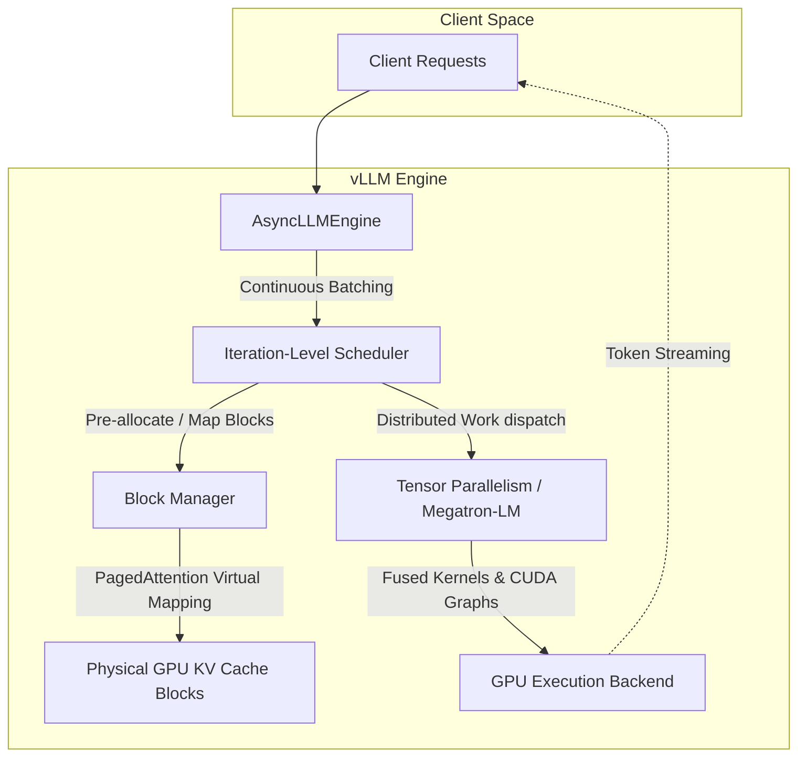
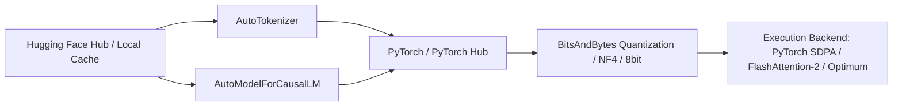
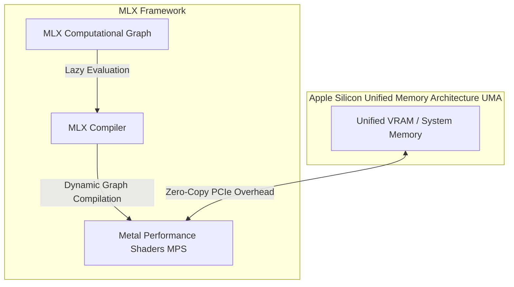
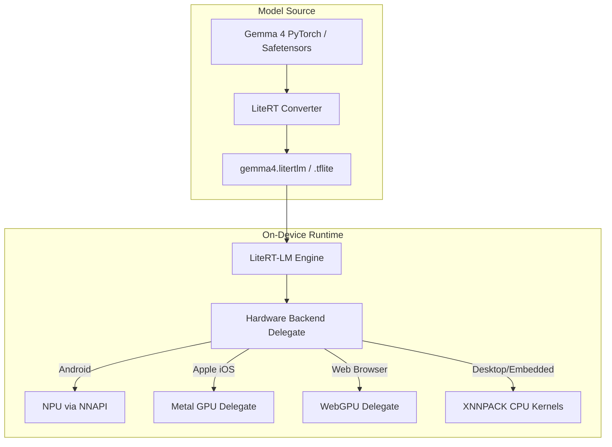
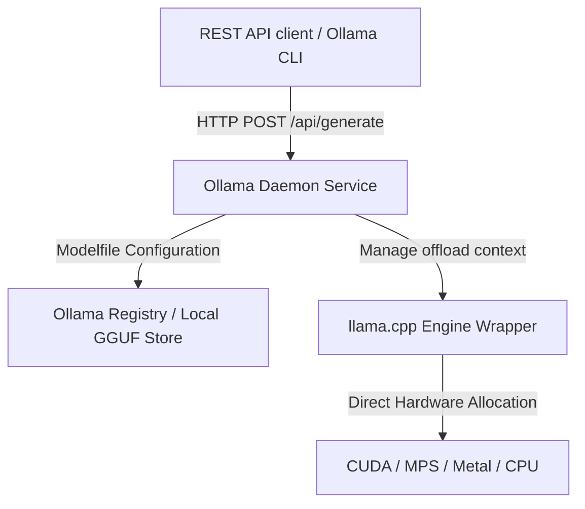
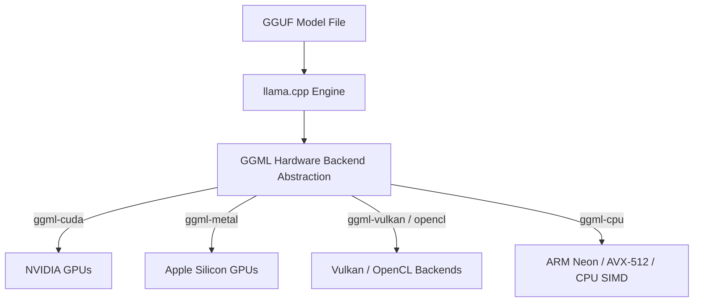
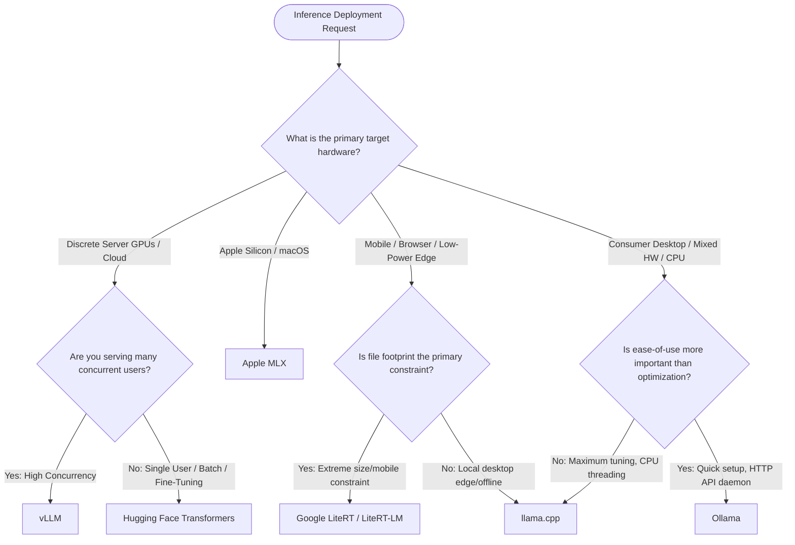

# Mainstream Model Runtimes and Inference Engines for Open LLMs: A Technical Deep Dive

In the modern landscape of generative artificial intelligence, selecting the optimal model runtime is just as critical as choosing the model weights themselves. The performance of on-device and server-side LLMs is constrained by memory bandwidth, computational latency, and concurrent request handling.

This document provides a highly detailed architectural analysis of six mainstream inference engines and runtimes: **vLLM**, **Hugging Face Transformers**, **Apple MLX**, **Google LiteRT & LiteRT-LM** (formerly TensorFlow Lite / MediaPipe), **Ollama**, and **llama.cpp**. To ground these runtimes in a practical engineering context, we focus on deploying the **Gemma 4 E2B (2B)** and **Gemma 4 E4B (4B)** multimodal, open-weights models.

---

## 1. Architectural Directory of Runtimes

### 1.1 vLLM



#### Architectural Architecture & Design Principles
vLLM is a high-throughput, low-latency serving engine designed specifically for large-scale production deployments on high-performance discrete GPUs (NVIDIA CUDA, AMD ROCm). Its primary architectural breakthrough is **PagedAttention**, which addresses the severe memory fragmentation and waste caused by the Key-Value (KV) cache in traditional autoregressive generation. 

In standard transformer inference, the KV cache grows dynamically, leading to virtual memory fragmentation ("internal" and "external") and reservation waste, where up to 60-80% of memory is pre-allocated but never utilized. PagedAttention divides the KV cache of each sequence into fixed-size physical blocks (similar to virtual memory paging in operating systems). A **Block Manager** maintains a mapping table that links logical KV blocks to non-contiguous physical blocks on the GPU, completely eliminating memory fragmentation and allowing vLLM to utilize almost 96% of available VRAM.

Additionally, vLLM utilizes **Continuous Batching** (iteration-level scheduling). Instead of waiting for an entire batch to complete generation before scheduling new requests (which wastes idle compute resources due to early-finishing sequences), vLLM injects new requests into the execution queue at the token-generation level.

#### Key Technical Features
*   **Precision Formats:** FP16, BF16, FP8 (via FP8 E4M3/E5M2 execution), and quantized formats.
*   **Quantization:** AWQ, GPTQ, SqueezeLLM, and FP8 scaling factors.
*   **Parallelism:** Out-of-the-box Megatron-LM-style **Tensor Parallelism (TP)** across multiple GPUs on a single node, and **Pipeline Parallelism (PP)** for multi-node setups.
*   **Optimizations:** Fused CUDA kernels (e.g., FlashAttention-2, FlashDecoding), **CUDA Graphs** to minimize CPU dispatch overhead for small batch/sequence sizes, and automatic **Prefix Caching** (sharing the KV cache of system prompts across different user requests).

#### Targeted Deployment Environments
*   **Primary Target:** Enterprise-grade cloud deployments and multi-GPU nodes (AWS, GCP, GCP Cloud Run, GKE, on-premise Kubernetes clusters).
*   **Best For:** High-concurrency production REST APIs, SaaS platforms, and multi-tenant conversational interfaces requiring high throughput (tokens/second/system).

#### Gemma 4 E2B/E4B Implementation Reference
vLLM provides both a Python offline inference SDK and an OpenAI-compatible web server CLI.

##### CLI (Serving the model as an API)
```bash
# Launch vLLM server serving Gemma 4 E4B Instruct with FP8 quantization and prefix caching
python3 -m vllm.entrypoints.openai.api_server \
    --model google/gemma-4-e4b-it \
    --quantization fp8 \
    --enable-prefix-caching \
    --gpu-memory-utilization 0.90 \
    --port 8000
```

##### Python SDK
```python
from vllm import LLM, SamplingParams

# 1. Initialize the LLM engine with Gemma 4 E2B IT
# vLLM automatically calculates GPU memory availability and partitions the KV Cache
llm = LLM(
    model="google/gemma-4-e2b-it",
    trust_remote_code=True,
    tensor_parallel_size=1, # Single-GPU deployment
    gpu_memory_utilization=0.85,
    max_model_len=8192
)

# 2. Define sampling constraints
sampling_params = SamplingParams(
    temperature=0.7,
    top_p=0.9,
    max_tokens=512,
    stop=["<end_of_turn>", "<eos>"]
)

# 3. Define chat-templated inputs
prompts = [
    "<start_of_turn>user\nExplain the concept of quantum superposition in simple terms.<end_of_turn>\n<start_of_turn>model\n"
]

# 4. Generate completions (offline batched inference)
outputs = llm.generate(prompts, sampling_params)

for output in outputs:
    prompt = output.prompt
    generated_text = output.outputs[0].text
    print(f"Prompt: {prompt}\nGenerated Text: {generated_text}")
```

---

### 1.2 Hugging Face Transformers



#### Architectural Architecture & Design Principles
Hugging Face Transformers is the industry-standard software library for prototyping, developing, and experimenting with open-weights LLMs. Architecturally, it is built as a highly flexible, PyTorch-native wrapper that abstracts model-specific implementations into unified interfaces (`AutoModelForCausalLM`, `AutoTokenizer`). 

Unlike compiled runtimes that optimize for execution graph compilation and throughput, Transformers focuses on modularity, readability, and immediate "day-0" support for newly released architectures. The standard execution relies on dynamic PyTorch graphs. To mitigate PyTorch's execution latency, modern Transformers integrates directly with **Scaled Dot-Product Attention (SDPA)** (built into PyTorch 2.x), **FlashAttention-2**, and **Optimum** compilers (which generate static ONNX, OpenVINO, or TensorRT-LLM graphs).

#### Key Technical Features
*   **Precision Formats:** FP32, FP16, BF16, FP8.
*   **Quantization:** Deeply integrated with `bitsandbytes` (providing **QLoRA** with 4-bit NormalFloat [NF4] and 8-bit integer quantization), and Hugging Face `optimum` (AWQ, GPTQ, EETQ).
*   **Parallelism:** Uses PyTorch-native `device_map="auto"` (which relies on `accelerate` to partition the model across multiple GPUs or offload layers to system RAM/disk) and DeepSpeed ZeRO for training/inference scaling.
*   **Optimizations:** Simple integration of external attention kernels, parameter-efficient fine-tuning (PEFT/LoRA) out of the box, and structured generation (via guidance/outlines integrations).

#### Targeted Deployment Environments
*   **Primary Target:** Research workstations, local developer setups, training/fine-tuning environments, and low-concurrency pipelines (such as batch offline data labeling).
*   **Best For:** Prototyping, evaluating newly released model checkpoints, training custom adapters (LoRA), and deployments where model modification and dynamic custom loss functions are necessary.

#### Gemma 4 E2B/E4B Implementation Reference
The following snippet showcases loading a model in 4-bit precision with FlashAttention-2 enabled for low-memory, high-speed inference.

```python
import torch
from transformers import AutoModelForCausalLM, AutoTokenizer, BitsAndBytesConfig

model_id = "google/gemma-4-e4b-it"

# 1. Configure bitsandbytes 4-bit quantization (NF4)
quantization_config = BitsAndBytesConfig(
    load_in_4bit=True,
    bnb_4bit_use_double_quant=True,
    bnb_4bit_quant_type="nf4",
    bnb_4bit_compute_dtype=torch.bfloat16
)

# 2. Initialize tokenizer
tokenizer = AutoTokenizer.from_pretrained(model_id)

# 3. Load model with quantization, automatic GPU mapping, and FlashAttention-2
model = AutoModelForCausalLM.from_pretrained(
    model_id,
    quantization_config=quantization_config,
    device_map="auto",
    attn_implementation="flash_attention_2",  # Requires FlashAttention-2 installed
    torch_dtype=torch.bfloat16,
    trust_remote_code=True
)

# 4. Format prompt using Gemma 4 Chat Template
messages = [
    {"role": "user", "content": "Analyze the difference between Rust and Go for systems programming."}
]
input_ids = tokenizer.apply_chat_template(
    messages, 
    add_generation_prompt=True, 
    return_tensors="pt"
).to("cuda")

# 5. Execute generation
with torch.no_grad():
    outputs = model.generate(
        input_ids,
        max_new_tokens=512,
        do_sample=True,
        temperature=0.6,
        top_k=50,
        top_p=0.95,
        eos_token_id=tokenizer.eos_token_id
    )

response = tokenizer.decode(outputs[0][input_ids.shape[-1]:], skip_special_tokens=True)
print(response)
```

---

### 1.3 Apple MLX



#### Architectural Architecture & Design Principles
MLX is an array framework designed specifically for machine learning research on Apple Silicon (M-series SOCs: M1, M2, M3, M4, and their Pro/Max/Ultra variants). Built by Apple's core machine learning research team, MLX's foundational design principle is its deep alignment with Apple's **Unified Memory Architecture (UMA)**. 

In standard architectures, running LLM inference requires copying model weights from CPU memory (RAM) to discrete GPU memory (VRAM) across a constrained PCIe bus. In Apple Silicon, the CPU, GPU, and Neural Engine share a single high-bandwidth physical memory space. MLX exploits this by enabling **zero-copy memory operations**: tensors are stored in unified memory, allowing the Metal Shaders (GPU) and ARM Neon kernels (CPU) to perform computations on the exact same physical memory address without any data transfer overhead.

Furthermore, MLX utilizes **lazy evaluation** and **graph compilation**. Graph execution is deferred until a material output is required, allowing the compiler to perform dead-code elimination, optimize memory allocations, and fuse operations into single Metal kernels before compilation.

#### Key Technical Features
*   **Precision Formats:** FP32, FP16, BF16.
*   **Quantization:** Highly optimized uniform weight-only quantization (2-bit, 3-bit, 4-bit, 8-bit) directly targeting Metal performance kernels.
*   **Parallelism:** Single-chip scale optimization.
*   **Optimizations:** Custom-written Metal kernels for attention (multi-head and group-query attention), dynamic shape compilation, and native implementation of weight-only quantized matrix multiplications on Apple Silicon GPUs.

#### Targeted Deployment Environments
*   **Primary Target:** macOS workstations, laptops, and Apple Edge devices (M-series Macs, iPads, and iOS environments).
*   **Best For:** Local native Mac application integration, local AI development on laptops, and personal productivity tools running fully private, offline LLMs.

#### Gemma 4 E2B/E4B Implementation Reference
The `mlx-lm` library is a high-level wrapper built on top of MLX to easily orchestrate LLM inference.

##### Python SDK
```python
from mlx_lm import load, generate

# 1. Load the model from HF Hub or local cache
# mlx_lm automatically detects Apple Silicon GPU, loads weights,
# and compiles the graph for the Apple Silicon Metal backend.
# We load a pre-quantized 4-bit Gemma 4 E2B model
model_path = "mlx-community/gemma-4-e2b-it-4bit"
model, tokenizer = load(model_path)

# 2. Define the input sequence with Gemma 4's expected turn structure
prompt = "Explain unified memory in Apple Silicon."
messages = [{"role": "user", "content": prompt}]
formatted_prompt = tokenizer.apply_chat_template(messages, add_generation_prompt=True)

# 3. Generate response
# MLX compiles the model on the fly and streams generation
response = generate(
    model,
    tokenizer,
    prompt=formatted_prompt,
    temp=0.7,
    max_tokens=256,
    verbose=True # Displays real-time tokens/sec generation stats
)

print(response)
```

##### Command Line Interface (CLI)
```bash
# Directly run inference from the terminal using mlx_lm
python3 -m mlx_lm.generate \
    --model mlx-community/gemma-4-e2b-it-4bit \
    --prompt "Write a Python script to compute Fibonacci numbers using dynamic programming." \
    --max-tokens 512 \
    --temp 0.2
```

---

### 1.4 Google LiteRT & LiteRT-LM



#### Architectural Architecture & Design Principles
**LiteRT** (formerly known as TensorFlow Lite) and its specialized submodule **LiteRT-LM** represent Google's official, production-ready runtime for executing machine learning models on-device and on edge hardware. 

LiteRT-LM is architected around a binary serialization format (`.litertlm` and `.tflite`), which maps models into flatbuffers. This architecture avoids loading heavy runtime libraries, minimizing initialization overhead and peak RAM requirements. 

Unlike server-side engines, LiteRT-LM uses a **delegation model**. The core engine orchestrates execution, but delegates actual execution to highly specialized hardware backends on-device. This includes **XNNPACK** (an optimized library for mobile and desktop CPU floating-point operations), **GPU delegates** (Metal on iOS/macOS, OpenCL/Vulkan on Android, and WebGPU on the web), and **NPU delegates** (specifically utilizing Google's Edge TPU, Samsung's NPU, and Apple's Neural Engine).

#### Key Technical Features
*   **Precision Formats:** Optimized for 4-bit integer, 8-bit integer, and FP16 formats.
*   **Quantization:** Post-training integer quantization (PTQ) and weight-only 4-bit/8-bit compression.
*   **Optimizations:** Fixed-memory overhead constraints, memory-mapped I/O (loading files directly from disk without copying), and hardware-specific compilation graphs matching mobile NPU structures.

#### Targeted Deployment Environments
*   **Primary Target:** Android mobile phones, Apple iOS devices, single-board computers (Raspberry Pi), embedded systems, and modern web browsers (Chrome/Safari via WebAssembly/WebGPU).
*   **Best For:** Native mobile applications, client-side browser extensions, resource-constrained offline edge solutions, and deployments requiring deterministic zero-memory-leak performance.

> [!NOTE]
> Google has transitioned its on-device LLM inference strategy. While the **MediaPipe LLM Inference API** remains in maintenance-only mode for legacy systems, new production deployments should target **LiteRT-LM** for direct low-level hardware delegation (NPU/GPU).

#### Gemma 4 E2B/E4B Implementation Reference

##### Modern LiteRT-LM Python Workflow
```python
import litert_lm

# 1. Initialize the LiteRT-LM Engine with the compiled model
# We specify the NPU backend to utilize dedicated mobile silicon
model_path = "models/gemma-4-e2b-it.litertlm"
backend = litert_lm.Backend.NPU()

with litert_lm.Engine(model_path, backend=backend) as engine:
    # Create an active conversation session with the engine
    with engine.create_conversation() as conversation:
        # Prompt the model using Gemma 4 structures
        response = conversation.send_message(
            "What are three key security measures when building mobile apps?"
        )
        print(f"LiteRT-LM Response:\n{response}")
```

##### Legacy MediaPipe LLM Inference API Workflow
If managing an existing system that relies on the MediaPipe task library, the model must be packed into a `.task` bundle:

```python
# Optional step: Bundling the .tflite weights with the tokenizer
from mediapipe.tasks.python.genai import bundler

config = bundler.BundleConfig(
    tflite_model="models/gemma-4-e2b.tflite",
    tokenizer_model="models/gemma_tokenizer.model",
    start_token="<s>",
    stop_tokens=["</s>", "<end_of_turn>"],
    output_filename="models/gemma-4-e2b.task",
    enable_bytes_to_unicode_mapping=True
)
bundler.create_bundle(config)

# Run Inference
from mediapipe.tasks.python import genai

# Initialize the inference session from the compiled task
llm_inference = genai.LlmInference.create_from_model_path("models/gemma-4-e2b.task")

# Synchronous generation
prompt = "<start_of_turn>user\nDraft a polite decline email to a client.<end_of_turn>\n<start_of_turn>model\n"
response = llm_inference.generate_response(prompt)
print(response)
```

---

### 1.5 Ollama



#### Architectural Architecture & Design Principles
Ollama is a high-level orchestration engine that packages local LLM deployments into a container-like ecosystem. Architecturally, Ollama runs as a system daemon background process (`ollamad`) written in Go, acting as a lightweight proxy service wrapping a heavily optimized C++ core powered by **llama.cpp**. 

Ollama's core design philosophy is abstracting away the low-level complexities of model execution. It manages the complete model lifecycle: download, verification, prompt template formatting, context caching, and GPU/CPU resource allocation. 

Ollama reads GGUF format files. It parses hardware specifications and determines the optimal layer offload ratio automatically. If a GPU (NVIDIA CUDA, Apple MPS, or AMD ROCm) has sufficient VRAM, Ollama offloads all model layers to the GPU; if VRAM is constrained, it calculates a split execution path, keeping the lower-level layers on the CPU while routing active execution streams dynamically.

#### Key Technical Features
*   **Precision Formats:** Broad support for GGUF quantizations (typically standardizing on `Q4_K_M` for default downloads, but supports `Q2_K` through `Q8_0` and FP16).
*   **Quantization:** Leverages llama.cpp's block-wise quantization methods.
*   **Parallelism:** Automatically supports multi-GPU offloading (CUDA / ROCm).
*   **Serving:** Exposes an asynchronous, highly performant HTTP REST API mimicking OpenAI's structure, complete with standard CORS headers, streaming JSON buffers, and multi-model concurrent execution queues.

#### Targeted Deployment Environments
*   **Primary Target:** Developer workstations, local desktop platforms (macOS, Windows, Linux), and private on-premise servers.
*   **Best For:** Rapid application development, local agent frameworks (e.g., CrewAI, AutoGen, LangChain), and desktop integrations requiring an easy-to-manage local LLM daemon with minimal configuration.

#### Gemma 4 E2B/E4B Implementation Reference
Ollama's ease of use shines in terminal and direct SDK interactions.

##### Modelfile Definition (`Gemma4Modelfile`)
Ollama allows custom system instructions, temperature configurations, and chat templates via a `Modelfile`.

```dockerfile
# Define base model
FROM gemma2:2b

# Configure parameters
PARAMETER temperature 0.3
PARAMETER top_p 0.9
PARAMETER stop "<end_of_turn>"
PARAMETER stop "<eos>"

# Set the system instruction
SYSTEM You are a highly professional research assistant specializing in computer science. Respond accurately and concisely.
```

Create and run your model using:
```bash
# Build custom model from Modelfile
ollama create gemma4-custom -f ./Gemma4Modelfile

# Run interactive terminal session
ollama run gemma4-custom
```

##### Python SDK
```python
import ollama

# 1. Non-streaming request using the Ollama SDK
response = ollama.chat(
    model='gemma2:2b', # Or your custom 'gemma4-custom' model
    messages=[
        {
            'role': 'user',
            'content': 'Write a comprehensive unit test for a FastAPI endpoint in Python.',
        },
    ]
)
print("Non-streaming response:")
print(response['message']['content'])

# 2. Streaming response
print("\nStreaming response:")
stream = ollama.chat(
    model='gemma2:2b',
    messages=[{'role': 'user', 'content': 'List 5 classic books on software architecture.'}],
    stream=True,
)

for chunk in stream:
    print(chunk['message']['content'], end='', flush=True)
print()
```

---

### 1.6 llama.cpp



#### Architectural Architecture & Design Principles
llama.cpp, created by Georgi Gerganov, is a pure C/C++ inference runtime for LLMs. Architecturally, llama.cpp is engineered with zero external dependencies and sits directly on top of **GGML** (a custom tensor library written in C designed for structural optimization and high performance on commodity hardware).

llama.cpp's design centers on performance maximization across heterogeneous system hardware. To achieve this, it provides explicit vectorization pipelines utilizing SIMD instruction sets such as **ARM Neon** (on Apple Silicon and ARM CPUs), **AVX2 / AVX-512** (on Intel and AMD CPUs), and **VSX** (on POWER architectures). 

The model weights are packaged into a single self-contained binary file called **GGUF** (GPT-Generated Unified Format). GGUF contains both the model hyper-parameters, metadata, tokenizer configuration, and actual tensor arrays inside a single contiguous file block. This enables fast **memory-mapping** (using `mmap` syscalls), meaning llama.cpp can load massive models almost instantaneously without allocating contiguous heap memory structures beforehand.

For hardware acceleration, llama.cpp splits model layers and schedules their compute across various backends dynamically. For example, if a model has 28 layers, a user can configure 18 layers to run on the GPU while the remaining 10 layers execute on the CPU via highly parallelized CPU thread-pools.

#### Key Technical Features
*   **Precision Formats:** Broad native quantization spectrum: 1.5-bit (IQ1_S), 2-bit (Q2_K), 3-bit (Q3_K_M), 4-bit (Q4_K_M), 5-bit (Q5_K_M), 6-bit (Q6_K), 8-bit (Q8_0), FP16, FP32.
*   **Quantization:** Block-wise quantization. Tensors are split into blocks of 32 or 256 weights, and each block is scaled and biased independently, retaining high model perplexity even at ultra-low precisions.
*   **Parallelism:** Thread-level CPU parallelism, multi-GPU CUDA scaling, and distributed network execution (splitting inference across multiple distinct network nodes).
*   **Optimizations:** KV cache quantization (INT8/INT4 cache quantization to preserve RAM), memory mapping, custom CUDA kernels, and state-of-the-art batched inference.

#### Targeted Deployment Environments
*   **Primary Target:** Commodity consumer hardware, desktops without discrete high-end GPUs, legacy servers, single-board computers (Raspberry Pi), embedded systems, and macOS workstations.
*   **Best For:** Ultra-low-resource hardware deployments, highly optimized cross-platform desktop applications (e.g., LM Studio, Jan, AnythingLLM), and situations where complete control over CPU threads, execution cores, and hardware-specific offloading is required.

#### Gemma 4 E2B/E4B Implementation Reference
Inference can be executed using either the raw compiled C++ CLI or the `llama-cpp-python` bindings.

##### Raw C++ CLI (Executing compiled `llama-cli`)
```bash
# Compile llama.cpp inside cloned repository:
# make -j (CPU/AVX) or make GGML_CUDA=1 (for CUDA) or make GGML_METAL=1 (for Apple Silicon)

# Run compiled CLI with 4-bit GGUF model offloading 20 layers to the Metal/CUDA GPU
./llama-cli \
    --model models/gemma-4-e2b-it.Q4_K_M.gguf \
    --prompt "<start_of_turn>user\nDefine architectural trade-offs between monoliths and microservices.<end_of_turn>\n<start_of_turn>model\n" \
    --n-predict 512 \
    --temp 0.4 \
    --threads 8 \
    --n-gpu-layers 20
```

##### Python Bindings (`llama-cpp-python`)
```python
from llama_cpp import Llama

# 1. Initialize llama.cpp Llama instance
# Offload 28 layers (the entire model for Gemma 4 E2B) to GPU
# Set context size to 4096 tokens
llm = Llama(
    model_path="models/gemma-4-e2b-it.Q4_K_M.gguf",
    n_gpu_layers=-1,      # -1 instructs the engine to offload ALL layers to GPU
    n_ctx=4096,           # Set custom context window size
    n_threads=4,          # Allocate CPU thread-pool size
    verbose=True          # Enable detailed timing printing
)

# 2. Execute a structured chat completion
# llama.cpp manages internal state-space tracking and KV cache mapping
response = llm.create_chat_completion(
    messages=[
        {
            "role": "user",
            "content": "Compare and contrast asynchronous and synchronous communication in distributed systems."
        }
    ],
    temperature=0.5,
    max_tokens=256
)

print(response['choices'][0]['message']['content'])
```

---

## 2. Multi-Dimensional Comparison Matrix

The table below provides a comprehensive comparison of the six runtimes when executing Gemma 4 E2B (2B) or E4B (4B) model weights.

| Evaluation Metric | vLLM | HF Transformers | Apple MLX | Google LiteRT & LiteRT-LM | Ollama | llama.cpp |
| :--- | :--- | :--- | :--- | :--- | :--- | :--- |
| **Primary Target Hardware** | Enterprise Discrete GPUs (NVIDIA CUDA, AMD ROCm) | Diverse (CUDA, CPU, Apple Silicon via MPS) | macOS / Apple Silicon (M1-M4 series) | Mobile/Edge devices (Android, iOS, Web browsers) | Developer Desktops (macOS, Windows, Linux) | CPU-centric and Heterogeneous Systems (CUDA, Metal, CPU SIMD) |
| **Typical Memory Overhead** | **High** (Pre-allocates major blocks for KV Cache; needs ~80-90% of VRAM by default) | **Medium-High** (Depends on PyTorch allocation and precision; can be high with BF16/FP16) | **Low-Medium** (Shares system RAM with CPU/GPU zero-copy; very low allocation leaks) | **Extremely Low** (Strictly bounded limits; flatbuffer binary optimization) | **Low-Medium** (Depends on GGUF format and background daemon context allocation) | **Extremely Low** (Direct control of memory, direct memory map `mmap` with zero heap allocation) |
| **Serving Throughput (Tokens/s/system)** | **Exceptional** (Pioneers continuous batching and PagedAttention for high concurrent streams) | **Low** (Dynamic graph creation and PyTorch overhead limit concurrency performance) | **High** (High unified memory bandwidth speeds up processing for single requests) | **Medium-Low** (Engineered for on-device single streams rather than multi-tenant servers) | **Medium** (Excellent single-user stream throughput; has API queuing but lacks PagedAttention) | **Medium-High** (Fast single-user performance; scales nicely with thread-pool optimization) |
| **Time-to-First-Token (TTFT / Latency)** | **Low** (Optimized prefix caching and fused kernels, but affected by heavy graph setup) | **Medium-High** (PyTorch runtime dispatch latency and dynamic model loading) | **Extremely Low** (Immediate compilation and memory bandwidth bypasses bus delays) | **Extremely Low** (Flatbuffer loading and direct hardware pipeline binding) | **Low** (Extremely fast launch from GGUF and immediate hardware dispatch) | **Extremely Low** (Instant load via `mmap` and highly vectorized hardware execution) |
| **Supported Precision & Quantizations** | FP16, BF16, FP8, AWQ, GPTQ, SqueezeLLM | FP32, FP16, BF16, FP8, QLoRA (NF4/FP4), AWQ, GPTQ | FP32, FP16, BF16, 2-to-8 bit weight-only quantization | INT4, INT8, FP16 | GGUF Quantization formats (Q2_K to Q8_0, FP16) | Comprehensive (GGUF, IQ1_S to Q8_0, FP16, FP32, INT4/INT8 KV Cache) |
| **Concurrency & Multi-Tenancy** | **Industry Best** (Iteration-level scheduling handles thousands of active server requests) | **Poor** (Requires custom orchestration, worker thread wrapping, or multi-process pools) | **Poor** (Optimized for local application execution) | **Extremely Poor** (Single consumer-oriented thread execution) | **Medium** (Has internal request queue and API pipeline, but performance degrades on concurrency) | **Medium** (Supports parallel generation via internal multi-slot context, but resource-bound) |
| **Pros** | - Unmatched serving throughput<br>- PagedAttention prevents memory leakage<br>- Dynamic Multi-LoRA support<br>- Built-in API server | - Day-0 support for new architectures<br>- Native integration with training pipelines<br>- Unmatched developer community support | - Seamless Zero-Copy memory integration<br>- Maximizes Apple Silicon GPU capabilities<br>- Lazy evaluation minimizes RAM overhead | - Native cross-platform integration<br>- Minimizes execution binary footprints<br>- Direct interface with mobile NPUs | - Instant startup<br>- High-level HTTP API<br>- Docker-like Modelfiles<br>- Automated resource management | - Highly optimized for CPU and edge<br>- Broad hardware acceleration backends<br>- Self-contained GGUF format<br>- Fast `mmap` initialization |
| **Cons** | - High memory footprint<br>- No native CPU support<br>- Heavy startup time | - Significant CPU dispatch latency<br>- High memory overhead<br>- Poor concurrency performance | - Exclusively bound to Apple hardware<br>- Lacks multi-node scaling | - Challenging model compile pipeline<br>- Limited custom layer support | - Background daemon consumes constant memory<br>- Lacks native enterprise security | - Complex command-line interfaces<br>- Manual system tuning required |
| **Best-Use Case** | Multi-user commercial APIs, enterprise chatbots, high-volume cloud deployments (e.g., serving Gemma 4 in GCP Cloud Run/GKE). | LLM architecture research, training, fine-tuning adapters (LoRA/QLoRA), prototype verification. | Local development on macOS, integrating LLM engines within Apple native macOS/iOS apps. | Native Android/iOS applications, on-device embedded systems (e.g., robotics), browser extensions. | Local developer desktops, quick prototyping of agent workflows, offline productivity tools. | Deploying LLMs on CPU-only servers, older hardware configurations, desktop application packaging. |

---

## 3. Structural Decision Flowchart

To choose the optimal model runtime for your deployment scenario, refer to the following decision logic:



---

## 4. Key Deployment Recommendations for Gemma 4 (2B/4B)

To run the Gemma 4 E2B (2B) or E4B (4B) model effectively, apply these optimization strategies:

### 4.1 Production Serving in the Cloud
If you are deploying Gemma 4 as a shared web service inside a cloud environment:
*   **Selected Runtime:** **vLLM**
*   **Optimization:** Deploy the model with **FP8 weight quantization** (`--quantization fp8`). For smaller model sizes like Gemma 4 E2B/E4B, this reduces VRAM footprint to around ~2.5GB to 4.5GB, leaving ample space for massive batch tables and enabling a highly concurrent serving environment.
*   **Performance Tuning:** Enable **Prefix Caching** (`--enable-prefix-caching`) to save KV-cache memory blocks for system instructions or conversational history in multi-turn contexts.

### 4.2 Local Prototyping and Agent Orchestration
If you are developing a local multi-agent system on an office laptop or consumer workstation:
*   **Selected Runtime:** **Ollama** or **llama.cpp**
*   **Optimization:** Download or convert the model to **GGUF format** using the `Q4_K_M` (4-bit Medium) quantization profile. This achieves a balance between reasoning quality (perplex loss is negligible compared to FP16) and processing latency.
*   **Performance Tuning:** In `llama.cpp`, configure the thread-pool size (`--threads`) to match the physical core count of your CPU (avoiding logical hyperthreaded cores) to prevent cache thrashing and optimize token generation speed.

### 4.3 Native Client-Side Edge Applications
If you are integrating Gemma 4 within a native mobile application or a local desktop client:
*   **Selected Runtime:** **Apple MLX** (for macOS/iOS targets) or **Google LiteRT-LM** (for Android/Web/Cross-Platform).
*   **Optimization:** For LiteRT-LM, pre-compile the model using **4-bit integer quantization (INT4)**. This allows the model to run on standard mobile hardware with less than 2GB of RAM.
*   **Performance Tuning:** For Apple MLX, utilize pre-quantized community weights from the `mlx-community` hub and ensure the system prompt uses **chat templates** explicitly. This ensures correct token parsing and avoids formatting issues that degrade model reasoning.
