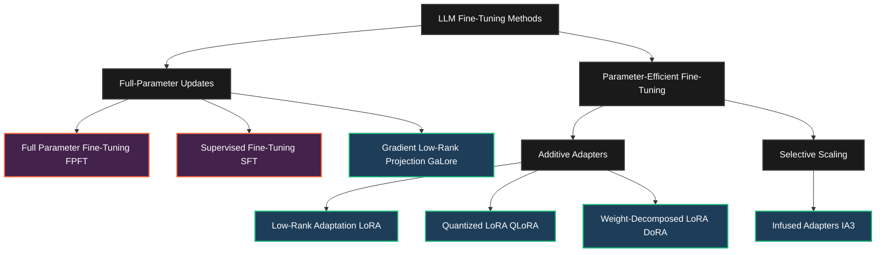
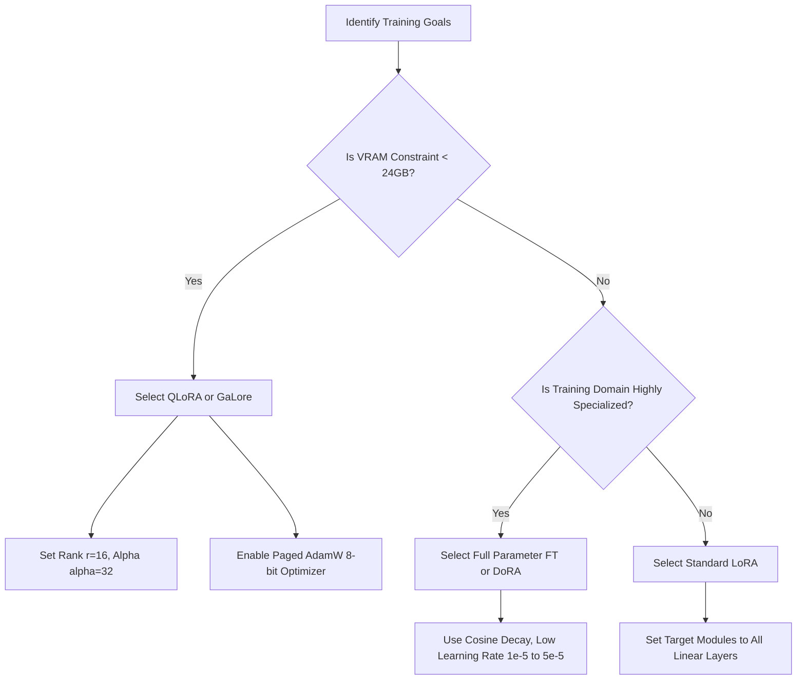

# LLM Fine-Tuning and Parameter-Efficient Fine-Tuning (PEFT) Methodologies

This document provides a highly rigorous, mathematical, and architectural deep dive into large language model (LLM) fine-tuning paradigms. It spans full-parameter training, supervised instruction alignment, and advanced parameter-efficient adaptation strategies, accompanied by complete, production-grade implementation examples across major machine learning frameworks.

---

## 1. Architectural and Mathematical Deep Dives

Training modern LLMs with billions of parameters requires balancing representational capacity with computational and hardware constraints. This section provides the mathematical foundations and architectural specifications of dominant training methodologies.



---

### 1.1 Full Parameter Fine-Tuning (FPFT)

In Full Parameter Fine-Tuning, every parameter across all layers of the pre-trained neural network is updated during training. 

#### Mathematical Formulation
Let the pre-trained neural network be parameterized by a set of weights $\theta_0 \in \mathbb{R}^N$. FPFT optimizes the entire parameter set to minimize a task-specific loss $\mathcal{L}$ over a dataset $\mathcal{D}$:

$$\theta^* = \arg\min_{\theta} \mathbb{E}_{(x, y) \sim \mathcal{D}} \left[ \mathcal{L}(f_\theta(x), y) \right]$$

During optimization, the parameter update at step $t+1$ with learning rate $\eta$ and gradient matrix $G_t = \nabla_{\theta_t} \mathcal{L}$ is:

$$\theta_{t+1} = \theta_t - \eta \cdot \text{Optimizer}(G_t)$$

#### Memory Allocation & Hardware Scaling
The primary bottleneck of FPFT is memory consumption. When training with a standard first-order optimizer like AdamW in mixed precision (BF16/FP16), the memory overhead per model parameter (of count $N$) scales as follows:

1. **Model Weights (BF16/FP16)**: $2N$ bytes
2. **Gradients (BF16/FP16)**: $2N$ bytes
3. **Optimizer States (AdamW)**:
   - **First Moment Vector ($m$) (FP32)**: $4N$ bytes
   - **Second Moment Vector ($v$) (FP32)**: $4N$ bytes
   - **Master Weights (FP32)**: $4N$ bytes (required for stable gradient updates in mixed-precision training)

$$\text{Static Parameter Memory} = 2N + 2N + 12N = 16N \text{ bytes}$$

> [!IMPORTANT]
> A 7B parameter model (e.g., Gemma 2 9B or Llama 3 8B) requires a minimum of **$16 \times 8 \times 10^9 \text{ bytes} \approx 128\text{ GB}$** of VRAM just to store static training states, completely ignoring the dynamic memory needed for **activation maps** and **kv-caching** during the forward-backward pass.

---

### 1.2 Supervised Fine-Tuning (SFT)

Supervised Fine-Tuning is the process of aligning a base model to follow instructions or act as a conversational assistant using high-quality prompt-response pairs.

#### Loss Formulation & Prompt Masking
Let a training sequence of length $L$ be composed of an input prompt (context) $x = \{x_1, \dots, x_M\}$ and a target response $y = \{y_1, \dots, y_T\}$, such that the complete token sequence is $S = x \cup y$. 

To prevent the model from wasting representational capacity on reconstructing the prompt, SFT utilizes a **masked autoregressive loss**. The causal language modeling loss is computed exclusively on the target tokens $y$:

$$\mathcal{L}_{\text{SFT}}(\theta) = -\sum_{t=1}^{T} \log P_{\theta}(y_t \mid x, y_{<t})$$

During computation, the loss function applies a binary mask $M_i$ to the sequence sequence positions $i \in \{1, \dots, M+T\}$:

$$M_i = \begin{cases} 0, & \text{if } i \le M \quad (\text{Prompt Token}) \\ 1, & \text{if } i > M \quad (\text{Target Token}) \end{cases}$$

The objective function minimized via gradient descent is:

$$\mathcal{L}(\theta) = -\frac{1}{\sum M_i} \sum_{i=1}^{M+T} M_i \log P_{\theta}(S_i \mid S_{<i})$$

---

### 1.3 Low-Rank Adaptation (LoRA)

LoRA freezes the pre-trained model weights $W_0 \in \mathbb{R}^{d \times k}$ and injects trainable rank decomposition matrices into the attention and feed-forward layers.

```
       Frozen Base Weight W0 (d x k)
             [============]
             [============]
                   |
  x (Input) ------+-------> [+] ---> Output h
                   |         ^
                   |         |  scaling (alpha/r)
                   v         |
                [  A  ] -----+
                Matrix A (k x r)
                (Gaussian Init)
                   |
                   v
                [  B  ]
                Matrix B (r x d)
                (Zero Init)
```

#### Low-Rank Decomposition
The fundamental hypothesis of LoRA is that the parameter updates during adaptation have a low "intrinsic dimension". Rather than updating $W_0$ directly, the update matrix $\Delta W \in \mathbb{R}^{d \times k}$ is parameterized as the product of two low-rank matrices $B \in \mathbb{R}^{d \times r}$ and $A \in \mathbb{R}^{r \times k}$ where $r \ll \min(d, k)$:

$$W = W_0 + \Delta W = W_0 + \frac{\alpha}{r} (B \times A)$$

#### Forward and Backward Passes
For an input vector $x \in \mathbb{R}^k$, the forward pass computation is:

$$h = W_0 x + \Delta W x = W_0 x + \frac{\alpha}{r} B(Ax)$$

The gradients during the backward pass are derived via the chain rule. Let $\frac{\partial \mathcal{L}}{\partial h} \in \mathbb{R}^{d \times 1}$ be the upstream gradient of the loss with respect to the output activation. The gradients with respect to the low-rank parameters are:

$$\frac{\partial \mathcal{L}}{\partial B} = \frac{\alpha}{r} \left( \frac{\partial \mathcal{L}}{\partial h} \right) (Ax)^T \in \mathbb{R}^{d \times r}$$

$$\frac{\partial \mathcal{L}}{\partial A} = \frac{\alpha}{r} B^T \left( \frac{\partial \mathcal{L}}{\partial h} \right) x^T \in \mathbb{R}^{r \times k}$$

To backpropagate the gradient to preceding layers in the transformer graph, we compute the gradient with respect to the input activation $x$:

$$\frac{\partial \mathcal{L}}{\partial x} = W_0^T \left( \frac{\partial \mathcal{L}}{\partial h} \right) + \frac{\alpha}{r} A^T B^T \left( \frac{\partial \mathcal{L}}{\partial h} \right) \in \mathbb{R}^{k \times 1}$$

> [!NOTE]
> Even though the base weights $W_0$ are frozen and do not collect gradients or optimizer states, $W_0$ must still be loaded in memory and participate in the backward pass matrix-vector product $W_0^T \left( \frac{\partial \mathcal{L}}{\partial h} \right)$ to propagate gradients down the computation tree.

---

### 1.4 Quantized LoRA (QLoRA)

QLoRA reduces the memory footprint of LoRA by quantizing the frozen base model to an information-theoretically optimal 4-bit representation, while keeping the low-rank adapters in high-precision (FP16/BF16).

```
   [ FP32/FP16 Activations x ]
                |
       +--------+--------+
       |                 |
       v                 v
[ NF4 Quantized ]   [ FP16/BF16 Adapters ]
[  Base Weight  ]   [ Matrix A & B (r)   ]
[    W0 (4-bit) ]        |
       |                 v
       | (On-the-fly     [ Scaled Update ]
       |  Dequantize     [  (alpha / r)  ]
       |  to FP16/BF16)  |
       v                 v
[ FP16 Base Out ] + [ FP16 Adapter Out ]
       |                 |
       +--------> [+] <--+
                 |
                 v
            [ Output h ]
```

#### NormalFloat 4 (NF4) Quantization
NF4 is built on Quantile Quantization, mapping a continuous normal distribution $\mathcal{N}(0, 1)$ to a discrete set of 16 values such that each bin has an equal number of expected values. Given the cumulative distribution function (CDF) $Q_x(\cdot)$ of a standard normal distribution, the 16 quantiles $q_i$ ($i \in [0, 15]$) are computed as:

$$q_i = \frac{1}{2} \left( Q_x\left(\frac{i}{2^k}\right) + Q_x\left(\frac{i+1}{2^k}\right) \right)$$

These values are normalized such that they map precisely to $[-1, 1]$. To quantize a weight block $W$ of a specific layer, we find the absolute maximum scaling factor $c_1$:

$$c_1 = \max(|W|)$$

$$W^{\text{NF4}} = \text{round}\left( \text{project}\left( \frac{W}{c_1} \rightarrow q_i \right) \right)$$

#### Double Quantization (DQ)
In traditional quantization, the block scaling factors $c_1$ are stored as 32-bit floats. For a block size of 64, this adds a memory overhead of $32 / 64 = 0.5$ bits per parameter. 

Double Quantization treats these primary constants $c_1$ as a normal distribution and quantizes them in turn. It maps blocks of size 256 of $c_1$ to 8-bit floats (FP8) with secondary quantization constants $c_2$ (stored as FP32). This reduces the scaling overhead:

$$\text{Quantization Overhead} = \frac{32 \text{ bits}}{64 \text{ (Block 1)}} \rightarrow \frac{8 \text{ bits}}{64} + \frac{32 \text{ bits}}{64 \times 256 \text{ (Block 2)}} \approx 0.125 + 0.0019 = 0.127 \text{ bits/parameter}$$

This saves approximately **$0.37 \text{ bits per parameter}$**, translating to over 3 GB of VRAM saved on a 70B parameter model.

#### Paged Optimizers
QLoRA integrates with the CUDA Unified Memory framework to execute zero-copy memory transfers between physical GPU VRAM and host system RAM. When an activation spike occurs during the backward pass (e.g., due to extreme sequence lengths), the paged optimizer allocates the optimizer states of non-active layers to CPU RAM, preventing physical Out-Of-Memory (OOM) failures at the expense of page-fault latency.

---

### 1.5 Weight-Decomposed Low-Rank Adaptation (DoRA)

DoRA analyzes the optimization pattern of standard LoRA and discovers a fundamental discrepancy: unlike full fine-tuning, which can scale the magnitude of updates independently of direction, standard LoRA forces magnitude and direction changes to be highly coupled. DoRA addresses this by decoupling weight updates into separate magnitude and directional components.

```
                  Weight W (d x k)
                         |
           +-------------+-------------+
           |                           |
           v                           v
     Magnitude Vector            Directional Matrix
      m (1 x k) [FP16]            V (d x k) [FP16]
           |                           |
           |                  +--------+--------+
           |                  v                 v
           |             Base Weight W0    LoRA Adapter
           |             (Frozen) [NF4]    B x A [FP16]
           |                  |                 |
           |                  +--------> [+] <--+
           |                             |
           |                             v
           |                      V = W0 + B x A
           |                             |
           v                             v
     [ Multiply ] <---------------- [ Normalize ]
           |                       (Column-wise L2)
           v
     Adapted Weight Matrix:
     W = m * (V / ||V||_c)
```

#### Mathematical Formulation
A pre-trained weight matrix $W_0 \in \mathbb{R}^{d \times k}$ can be decomposed into a scale-invariant directional matrix $V \in \mathbb{R}^{d \times k}$ and a magnitude vector $m \in \mathbb{R}^{1 \times k}$ containing the column-wise $L_2$ norms:

$$W_0 = m \cdot \frac{V}{\|V\|_c}$$

where $\|\cdot\|_c$ represents the column-wise vector norm:

$$\|V\|_c = \left[ \|V_{*, 1}\|_2, \, \|V_{*, 2}\|_2, \, \dots, \, \|V_{*, k}\|_2 \right] \in \mathbb{R}^{1 \times k}$$

During fine-tuning, DoRA keeps the magnitude vector $m$ as a trainable parameter, while updating the directional part $V$ using a standard LoRA adaptation pathway:

$$V = W_0 + \Delta V = W_0 + B \times A$$

The complete adapted weight matrix $W$ evaluated in the forward pass is:

$$W = m \cdot \frac{W_0 + BA}{\|W_0 + BA\|_c}$$

By updating $m$ and the directional component ($B \times A$) separately, DoRA allows the network to learn directional adjustments without scaling the weights up or down linearly, yielding performance metrics that closely match full fine-tuning.

---

### 1.6 Infused Adapter by Keeping Representation Bottlenecks ($IA^3$)

$IA^3$ introduces parameter-efficient scaling vectors that directly modulate the activation streams inside the self-attention and position-wise feed-forward networks (FFN) of transformer layers.

#### Architectural Modulations
$IA^3$ injects trainable vector parameters $l \in \mathbb{R}^d$ that perform element-wise scaling ($\odot$) on internal layer outputs. It targets three specific activation streams:

1. **Self-Attention Keys ($K$)**: Modulates the projection of the input sequence onto the key space:
   
   $$K' = K \odot l_K$$

2. **Self-Attention Values ($V$)**: Modulates the value projections before calculation of attention weights:
   
   $$V' = V \odot l_V$$

3. **FFN Intermediate Projection**: Modulates the high-dimensional hidden state generated in the feed-forward pathway before applying the down-projection layer:
   
   $$FFN(x)' = \left( \sigma(W_1 x) \odot l_{\text{FFN}} \right) W_2$$

Because these vectors scale the activations directly and have dimensions equal to the hidden layer size (typically $d \approx 4096$), $IA^3$ introduces less than **0.05%** trainable parameters compared to the base model.

---

### 1.7 Gradient Low-Rank Projection (GaLore)

GaLore (Gradient Low-Rank Projection) represents a paradigm shift. Instead of assuming the *weights* or weight updates are low-rank, it proves that the *gradient matrix* of the weights exhibits a low-rank structure. This allows full-parameter training (all weights can change arbitrarily) while keeping optimizer memory at a low-rank scale.

#### Mathematical Mechanics
Let $W \in \mathbb{R}^{m \times n}$ be a weight matrix, and $G \in \mathbb{R}^{m \times n}$ be its gradient at training step $t$. GaLore factorizes the gradient $G$ by projecting it into a compact low-rank subspace using orthogonal projection matrices $P_L \in \mathbb{R}^{m \times r}$ and $P_R \in \mathbb{R}^{n \times r}$, where $r \ll \min(m, n)$.

Using a left-side orthogonal projection $P_L^T P_L = I_r$:

$$\tilde{G}_t = P_L^T G_t \in \mathbb{R}^{r \times n}$$

During training, instead of instantiating Adam optimizer states (first and second moments) of size $m \times n$, GaLore only tracks the optimizer states for the projected gradient $\tilde{G}_t$ of size $r \times n$. 

The weight update rule is:

$$W_{t+1} = W_t - \eta \cdot P_L \cdot \text{AdamW}(\tilde{G}_t)$$

The projection matrix $P_L$ is computed dynamically using singular value decomposition (SVD) on the gradient matrix $G_t$ at periodic training intervals (e.g., every 100 steps):

$$G_t = U \Sigma V^T \implies P_L = U_{*, :r}$$

This periodic update mechanism captures the changing directional subspaces of the gradients while keeping the overhead of SVD projection low.

---

## 2. LoRA Conceptual and Formulaic Breakdown

The low-rank representation of weight updates is governed by several core mathematical hyperparameters that must be understood to optimize convergence.

### 2.1 The Intrinsic Rank ($r$) and Scaling Factor ($\alpha$)

The rank parameter $r \in \mathbb{Z}^+$ determines the bottleneck dimension of the adapter matrices. It represents the rank of the linear transformation matrix $\Delta W$:

$$\text{rank}(\Delta W) \le \min(\text{rank}(B), \text{rank}(A)) = r$$

The scaling constant $\alpha \in \mathbb{R}^+$ scales the adapter's outputs. The scaling factor $\frac{\alpha}{r}$ serves as a normalization constant:

$$\Delta W = \frac{\alpha}{r} (BA)$$

#### Impact on Training Dynamics
When compiling updates, the total weight update is:

$$W = W_0 + \frac{\alpha}{r} (BA)$$

- **Learning Rate Decoupling**: If $r$ is doubled during hyperparameter tuning, the values in the low-rank updates will scale. Setting the scaling factor to $\frac{\alpha}{r}$ ensures that when $r$ is modified, the magnitude of the adapter's update remains stable, removing the need to re-tune the learning rate $\eta$.
- **Intrinsic Dimension**: Research demonstrates that the "intrinsic dimension" of adaptation tasks is often small ($r \in [4, 16]$). Increasing $r$ beyond these limits does not yield linear improvements in accuracy and instead increases the risk of overfitting.

---

### 2.2 Mathematical Proof of Matrix Dimension Reductions

Consider a single linear layer in a transformer block (e.g., the Query projection layer in Gemma 2 9B):
- Input/Output Dimension: $d_{\text{model}} = 3584$
- Feed-forward Intermediate Dimension: $d_{\text{ff}} = 14336$

Let's compute the parameter savings when applying LoRA with rank $r=8$ to a standard query weight projection matrix $W_0 \in \mathbb{R}^{d_{\text{model}} \times d_{\text{model}}}$:

#### 1. Full Parameter Count (FPFT)
The baseline weight matrix requires:

$$P_{\text{base}} = d_{\text{model}} \times d_{\text{model}} = 3584 \times 3584 = 12,845,056 \text{ parameters } (\approx 12.8 \text{M})$$

#### 2. LoRA Parameter Count
The adapter consists of two matrices $A \in \mathbb{R}^{r \times d_{\text{model}}}$ and $B \in \mathbb{R}^{d_{\text{model}} \times r}$:

$$P_{\text{LoRA}} = (d_{\text{model}} \times r) + (r \times d_{\text{model}}) = 2 \times r \times d_{\text{model}}$$

$$P_{\text{LoRA}} = 2 \times 8 \times 3584 = 57,344 \text{ parameters } (\approx 0.057 \text{M})$$

#### 3. Percentage Compression Ratio ($C$)

$$C = \left( 1 - \frac{P_{\text{LoRA}}}{P_{\text{base}}} \right) \times 100\% = \left( 1 - \frac{57,344}{12,845,056} \right) \times 100\% \approx 99.55\% \text{ reduction}$$

This mathematical reduction demonstrates why PEFT techniques drastically lower storage and transmission overheads, enabling lightweight adapter sharing.

---

## 3. Library Implementations

This section provides complete, production-grade training scripts for fine-tuning a model (e.g., Gemma 2) using five mainstream frameworks.

---

### 3.1 Hugging Face TRL (`SFTTrainer`) & PEFT

This script loads a model in 4-bit NF4 with Double Quantization and trains it using TRL's `SFTTrainer` and PyTorch.

```python
import torch
from datasets import load_dataset
from transformers import (
    AutoModelForCausalLM,
    AutoTokenizer,
    BitsAndBytesConfig,
    TrainingArguments
)
from peft import LoraConfig, get_peft_model, prepare_model_for_kbit_training
from trl import SFTTrainer, SFTConfig

def run_peft_training():
    model_id = "google/gemma-2-9b-it"
    dataset_name = "imdb"

    # 1. NF4 Double Quantization Configuration
    bnb_config = BitsAndBytesConfig(
        load_in_4bit=True,
        bnb_4bit_quant_type="nf4",
        bnb_4bit_use_double_quant=True,
        bnb_4bit_compute_dtype=torch.bfloat16
    )

    # 2. Load Base Model and Tokenizer
    tokenizer = AutoTokenizer.from_pretrained(model_id)
    tokenizer.pad_token = tokenizer.eos_token
    
    model = AutoModelForCausalLM.from_pretrained(
        model_id,
        quantization_config=bnb_config,
        device_map="auto"
    )

    # 3. Prepare Model for Quantized Training
    model = prepare_model_for_kbit_training(model)

    # 4. Define PEFT LoRA Configuration
    lora_config = LoraConfig(
        r=16,
        lora_alpha=32,
        target_modules=["q_proj", "k_proj", "v_proj", "o_proj", "gate_proj", "up_proj", "down_proj"],
        lora_dropout=0.05,
        bias="none",
        task_type="CAUSAL_LM"
    )
    
    model = get_peft_model(model, lora_config)
    model.print_trainable_parameters()

    # 5. Load and Preprocess Dataset
    dataset = load_dataset(dataset_name, split="train[:1000]")

    def formatting_prompts_func(example):
        output_texts = []
        for i in range(len(example['text'])):
            text = f"Instruct: Classify the sentiment.\nInput: {example['text'][i]}\nOutput: {example['label'][i]}"
            output_texts.append(text)
        return output_texts

    # 6. Initialize SFT Config and Trainer
    training_args = SFTConfig(
        output_dir="./gemma_qlora_results",
        dataset_text_field="text",
        max_seq_length=512,
        packing=False,
        per_device_train_batch_size=2,
        gradient_accumulation_steps=4,
        warmup_ratio=0.03,
        max_steps=100,
        learning_rate=2e-4,
        fp16=False,
        bf16=True,
        logging_steps=10,
        optim="paged_adamw_8bit", # Prevents OOMs via unified host memory paging
        report_to="none"
    )

    trainer = SFTTrainer(
        model=model,
        train_dataset=dataset,
        formatting_func=formatting_prompts_func,
        args=training_args
    )

    # 7. Execute Training
    trainer.train()
    
    # Save Fine-tuned Adapters
    model.save_pretrained("./gemma_lora_adapters")
    tokenizer.save_pretrained("./gemma_lora_adapters")

if __name__ == "__main__":
    run_peft_training()
```

---

### 3.2 KerasNLP (Keras 3)

Keras 3 provides a unified API for training models across JAX, PyTorch, and TensorFlow backends. This script uses the KerasNLP high-level API to enable LoRA adapters.

```python
import os
# Select backend before importing Keras (options: "jax", "torch", "tensorflow")
os.environ["KERAS_BACKEND"] = "jax"

import keras
import keras_nlp

def run_keras_training():
    # 1. Load Pretrained Causal LM
    # GemmaCausalLM handles both model parameters and tokenizer natively
    causal_lm = keras_nlp.models.GemmaCausalLM.from_preset(
        "gemma2_instruct_2b_en"
    )

    # 2. Enable Parameter-Efficient Fine-Tuning (LoRA) on the Backbone
    # KerasNLP automatically targets all projection layers (q_proj, v_proj, etc.)
    causal_lm.backbone.enable_lora(rank=8)
    
    # Print compilation summary showing trainable vs frozen weights
    causal_lm.summary()

    # 3. Create Sample Dataset
    # Raw instruction format passed to prompt templates
    train_data = [
        "Instruction: Identify the capital.\nInput: France\nOutput: Paris",
        "Instruction: Identify the capital.\nInput: Japan\nOutput: Tokyo",
        "Instruction: Identify the capital.\nInput: Canada\nOutput: Ottawa",
    ] * 32

    # 4. Compile Model with AdamW and CrossEntropy Loss
    causal_lm.compile(
        loss=keras.losses.SparseCategoricalCrossentropy(from_logits=True),
        optimizer=keras.optimizers.AdamW(learning_rate=2e-4, weight_decay=0.01),
        weighted_metrics=["accuracy"]
    )

    # 5. Fit Model
    causal_lm.fit(
        train_data,
        batch_size=2,
        epochs=1
    )

    # Save fine-tuned weights
    causal_lm.save_weights("./k_gemma_lora_weights.weights.h5")

if __name__ == "__main__":
    run_keras_training()
```

---

### 3.3 Unsloth (Highly Optimized QLoRA)

Unsloth is a highly optimized library that compiles custom GPU kernels to accelerate LoRA training. It provides up to **2x-3x speedups** and reduces VRAM usage by **60%-80%** compared to standard PyTorch implementations.

```python
import torch
from unsloth import FastLanguageModel
from datasets import load_dataset
from trl import SFTTrainer, SFTConfig

def run_unsloth_training():
    max_seq_length = 2048
    dtype = None # Auto-detect GPU architecture (e.g., bfloat16 for Ampere/Ada Lovelace)
    load_in_4bit = True # Enable hardware-accelerated 4-bit NF4 quantization

    # 1. Load Optimized Model Kernels
    model, tokenizer = FastLanguageModel.from_pretrained(
        model_name="unsloth/gemma-2-9b-it-bnb-4bit",
        max_seq_length=max_seq_length,
        dtype=dtype,
        load_in_4bit=load_in_4bit,
    )

    # 2. Add Optimized LoRA Adapters
    model = FastLanguageModel.get_peft_model(
        model,
        r=16,
        target_modules=["q_proj", "k_proj", "v_proj", "o_proj", "gate_proj", "up_proj", "down_proj"],
        lora_alpha=32,
        lora_dropout=0, # Unsloth optimizes dropout=0 for maximum efficiency
        bias="none",
        use_gradient_checkpointing="unsloth", # 30% memory saving on activations
        random_state=42,
    )

    # 3. Load Instruction Dataset
    dataset = load_dataset("imdb", split="train[:500]")

    def format_imdb(example):
        return {"text": f"Review: {example['text']}\nSentiment: {'Positive' if example['label'] == 1 else 'Negative'}"}

    dataset = dataset.map(format_imdb)

    # 4. Instantiate SFTTrainer
    trainer = SFTTrainer(
        model=model,
        tokenizer=tokenizer,
        train_dataset=dataset,
        dataset_text_field="text",
        max_seq_length=max_seq_length,
        dataset_num_proc=2,
        args=SFTConfig(
            per_device_train_batch_size=2,
            gradient_accumulation_steps=4,
            warmup_steps=5,
            max_steps=60,
            learning_rate=2e-4,
            fp16=not torch.cuda.is_bf16_supported(),
            bf16=torch.cuda.is_bf16_supported(),
            logging_steps=1,
            output_dir="outputs",
            optim="adamw_8bit",
        ),
    )

    # 5. Execute Training Run
    trainer.train()

    # 6. Save Adapter weights
    model.save_pretrained("unsloth_lora_model")
    tokenizer.save_pretrained("unsloth_lora_model")

if __name__ == "__main__":
    run_unsloth_training()
```

---

### 3.4 JAX / EasyLM

In JAX/Flax, weights are stateless dictionaries (PyTrees). Because PEFT cannot "monkey-patch" standard layers as it does in PyTorch, we must define LoRA transformations explicitly as Flax Modules.

#### Flax Implementation of a LoRA Dense Layer
This snippet defines a native Flax linear layer containing a frozen base weight $W_0$ alongside dynamic, trainable $A$ and $B$ low-rank pathways:

```python
import jax
import jax.numpy as jnp
from flax import linen as nn

class FlaxLoRADense(nn.Module):
    """Native Flax implementation of a low-rank adapted dense projection layer."""
    features: int
    rank: int = 8
    alpha: float = 16.0
    use_bias: bool = True

    @nn.compact
    def __call__(self, inputs: jnp.ndarray) -> jnp.ndarray:
        # 1. Base Weight (Frozen during training)
        w0 = self.param(
            'kernel', 
            nn.initializers.glorot_uniform(), 
            (inputs.shape[-1], self.features)
        )
        
        # 2. Low-Rank Adapter A (Initialized to normal distribution)
        lora_a = self.param(
            'lora_A', 
            nn.initializers.normal(stddev=1.0 / self.rank), 
            (inputs.shape[-1], self.rank)
        )
        
        # 3. Low-Rank Adapter B (Initialized to zero)
        lora_b = self.param(
            'lora_B', 
            nn.initializers.zeros, 
            (self.rank, self.features)
        )

        # Base forward projection (y_base = x * W0)
        y_base = jnp.matmul(inputs, w0)
        
        # Low-rank forward update (y_lora = (x * A) * B)
        scaling = self.alpha / self.rank
        y_lora = jnp.matmul(jnp.matmul(inputs, lora_a), lora_b) * scaling

        if self.use_bias:
            bias = self.param('bias', nn.initializers.zeros, (self.features,))
            return y_base + y_lora + bias
        return y_base + y_lora
```

#### EasyLM Training Execution
EasyLM is a production-grade framework for scaling LLMs on TPU pods. It configures LoRA optimization by isolating JAX parameter updates using JAX's key paths:

```python
import optax
from EasyLM.models.gemma.gemma_model import GemmaConfig
from EasyLM.train_utils import train_step

def configure_jax_lora_optimizer(params):
    """
    Creates an optax multi-transform optimizer that freezes the base weight 
    parameters while compiling gradient updates exclusively on LoRA weights.
    """
    # 1. Define base learning rate for adapters
    adapter_tx = optax.adamw(learning_rate=2e-4, weight_decay=1e-4)
    # 2. Define zero-gradient optimizer for frozen weights
    frozen_tx = optax.set_to_zero()

    # 3. Map parameter keys to respective optimizers
    # If parameter key path contains 'lora_A' or 'lora_B', update it; otherwise, freeze it
    def label_fn(path, val):
        path_str = "/".join([str(p.key) for p in path])
        if "lora_A" in path_str or "lora_B" in path_str:
            return "adapter"
        return "frozen"

    param_labels = jax.tree_util.tree_map_with_path(label_fn, params)

    # 4. Construct Multi-Transform Optimizer
    tx = optax.multi_transform(
        transforms={"adapter": adapter_tx, "frozen": frozen_tx},
        param_labels=param_labels
    )
    return tx
```

---

## 4. Comprehensive Methodology Comparison

The table below outlines the trade-offs of major fine-tuning methodologies, analyzed under standard training parameters.

| Fine-Tuning Method | Trainable Params % | Memory Overhead (Model + Optimizers) | Compute Latency / Overhead | Ease of Setup & Tooling | Key Technical Features | Pros | Cons |
| :--- | :--- | :--- | :--- | :--- | :--- | :--- | :--- |
| **Full Parameter Fine-Tuning (FPFT)** | $100\%$ | **Extremely High**<br>$16N$ bytes (Mixed-precision AdamW) | **None (Baseline)** | **Low**<br>Requires deep clustering frameworks (DeepSpeed, Megatron) | Complete gradient calculation on entire weight graph. | Maximum learning capacity; excels at highly complex, novel domain adaptation. | High risk of Catastrophic Forgetting; requires massive server clusters. |
| **Supervised Fine-Tuning (SFT)** | $100\%$ (unless combined with PEFT) | **Extremely High** | **None** | **Moderate**<br>Supported by standard HF libraries | Masked target loss minimization; prompt masking. | Formats output structures; forces instruction following and persona alignment. | Requires large VRAM pools; susceptible to validation degradation. |
| **Low-Rank Adaptation (LoRA)** | $0.05\% \text{ - } 1.0\%$ | **Low**<br>Optimizer states tracked only for low-rank layers | **Negligible** | **Extremely High**<br>Natively integrated in PEFT, Keras 3, Diffusers | Parametric low-rank matrices ($B \times A$); scale parameterization $\alpha/r$. | Zero inference latency (adapters can be merged); highly portable adapter files ($\approx$10-50MB). | Slower adaptation on highly specialized datasets containing out-of-vocabulary domains. |
| **Quantized LoRA (QLoRA)** | $0.05\% \text{ - } 1.0\%$ | **Extremely Low**<br>Base model compressed to 4-bit NF4 | **Moderate**<br>$\approx$15-25% slowdown due to on-the-fly dequantization | **High**<br>Requires `bitsandbytes` + PEFT tooling | NF4 Optimal Bins; Double Quantization; CUDA Paged Optimizers. | Allows fine-tuning massive models (70B) on consumer GPUs (48GB VRAM) or 8B models on 8GB. | Slower training wall-clock times; depends heavily on CUDA platforms. |
| **Weight-Decomposed LoRA (DoRA)** | $0.06\% \text{ - } 1.1\%$ | **Low**<br>Slightly larger than LoRA due to magnitude vector $m$ | **Low** | **High**<br>Supported by PEFT (`use_dora=True`) | Column-wise magnitude scalar vectors; decoupled directional matrix. | Superior convergence stability; outperforms LoRA on standard instruction benchmarks. | Minor additional computation steps per backward pass. |
| **Infused Adapters ($IA^3$)** | $< 0.05\%$ | **Negligible** | **Negligible** | **High**<br>Supported in Hugging Face PEFT | Key, Value, and FFN intermediate activation scaling vectors. | Extremely small checkpoint footprints; highly effective for multi-task prompt multiplexing. | Lower representational ceiling for highly creative or unconstrained text generation. |
| **Gradient Low-Rank Projection (GaLore)** | $100\%$ (All parameters are updated) | **Moderate-Low**<br>Reduces optimizer state by $>60\%$ | **Moderate**<br>Periodic projection matrix updates | **Moderate**<br>Requires custom GaLore optimizer bindings | Gradient matrix SVD decomposition; projected AdamW states on low-rank spaces. | Achieves full-parameter training precision with resource metrics comparable to PEFT. | Periodic overhead from computing singular vectors via CPU/GPU. |

---

## 5. Architectural Guide to Hyperparameter Tuning

When configuring fine-tuning runs, hyperparameter choices dictate convergence stability and final task precision. Below is a structured blueprint for setting training hyperparameters based on your training methodology:



### 1. Target Module Optimization
For modern models (like Gemma 2 or Llama 3), applying LoRA exclusively to attention query and value layers ($W_q, W_v$) leads to suboptimal adaptation on complex formatting tasks. 
- **Production Standard**: Target **all linear projections** in the transformer block. This includes self-attention projections ($W_q, W_k, W_v, W_o$) and MLP gating/activation projections (`gate_proj`, `up_proj`, `down_proj`).

### 2. Symmetrical Rank-Alpha Selection
A safe rule-of-thumb is to set the scaling factor $\alpha$ to twice the rank $r$:

$$\alpha = 2 \times r$$

- **Task-specific configurations**:
  - **Conversational SFT / Formatting**: $r = 8$ or $16$, $\alpha = 16$ or $32$.
  - **Complex Coding / Math Adaptation**: $r = 32$ or $64$, $\alpha = 64$ or $128$.
  - **Classification Tasks**: $r = 4$ or $8$, $\alpha = 8$ or $16$.

### 3. Learning Rate and Decay Guidelines
- **LoRA / QLoRA / DoRA**: Keep learning rates higher: $\eta \in [1\times 10^{-4}, 3\times 10^{-4}]$ for stable adaptation without exploding gradients.
- **Full Parameter Fine-Tuning**: Keep learning rates extremely low: $\eta \in [5\times 10^{-6}, 2\times 10^{-5}]$ to prevent catastrophic forgetting.
- **Warmup Schedule**: Implement a linear warmup of $3\%$ to $5\%$ of total training steps, combined with a cosine learning rate decay schedule ending at $10\%$ of the peak learning rate.
