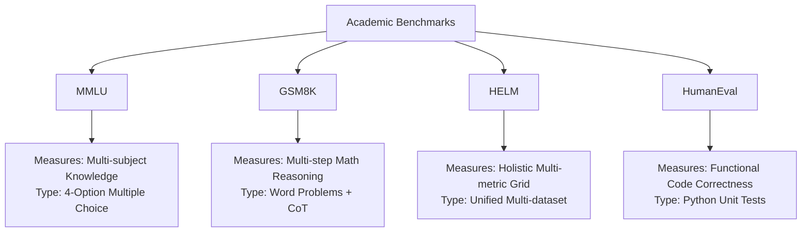
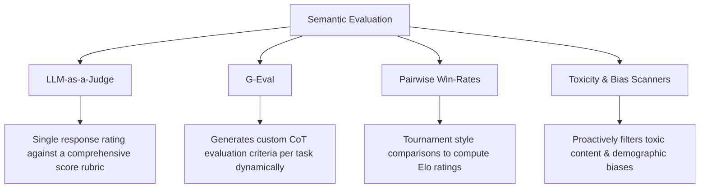

# LLM Evaluation Strategies: Academic Benchmarks, Programmatic Metrics, and LLM-as-a-Judge Paradigms

Evaluation is the cornerstone of robust LLM development. Because modern large language models exhibit non-deterministic behavior, generate open-ended natural language, and possess highly context-sensitive reasoning patterns, traditional software testing paradigms fail to capture their true capabilities and failure modes. 

A naive "vibe check"—where developers manually query a model with a handful of prompts and inspect the outputs—is insufficient for production deployments. A minor prompt modification or fine-tuning run can silently degrade performance on critical edge cases. 

This document details systematic evaluation methodologies across three distinct tiers:
1. **Academic Benchmarks**: Broad, standardized capability assessments.
2. **Programmatic Metrics**: Custom mathematical indicators for structured and classification-based tasks.
3. **Advanced Evaluation Paradigms**: Automated qualitative assessments via LLM-as-a-judge, G-Eval, and safety/toxicity scanners.

---

## 1. Industry-Standard Academic Benchmarks

Academic benchmarks serve as standardized standardized yardsticks to compare base models. However, implementing them in real-world workflows requires understanding their exact inner workings and severe systemic limitations.



### 1.1 MMLU (Massive Multitask Language Understanding)
* **What it Measures**: General knowledge and problem-solving abilities across 57 subjects spanning STEM, humanities, social sciences, and professional fields (medicine, law).
* **How it Works**: It consists of multiple-choice questions with four options (A, B, C, D). Models are tested in zero-shot or few-shot (typically 5-shot) setups. The evaluation measures **Exact Match (EM)** accuracy on the predicted option character (e.g., parsing if the model outputs "The answer is A" or simply "A").
* **Limitations & Vulnerabilities**:
  * **Prompt Sensitivity**: MMLU scores fluctuate drastically (up to 5–10% absolute variance) based on minor prompt perturbations, the ordering of few-shot examples, or whether options are separated by spaces or newlines.
  * **Option Order Bias**: Models often exhibit positional biases, favoring specific letters (e.g., "A" or "C") regardless of content. Permuting option choices can cause substantial drops in reported scores.
  * **Data Contamination**: Due to its public nature, MMLU test questions have leaked extensively into the web-crawl corpora used to train state-of-the-art models, leading to artificial score inflation.
  * **Ground-Truth Ambiguities**: A non-trivial percentage of MMLU questions contain factual errors, duplicate options, or ambiguous questions where multiple options are defensible.

### 1.2 GSM8K (Grade School Math 8K)
* **What it Measures**: High-quality, multi-step mathematical reasoning capabilities at a grade-school level.
* **How it Works**: It contains 8,500 linguistically diverse grade-school math word problems. Solving a problem requires 2 to 8 steps of basic arithmetic. It is typically evaluated using **Chain-of-Thought (CoT)** prompting. The system parses the final numeric answer—traditionally appended at the end of the generation following an separator (e.g., `#### 42`)—and compares it to the ground-truth number.
* **Limitations & Vulnerabilities**:
  * **Narrow Reasoning Scope**: GSM8K only tests basic arithmetic (+, -, \*, /) within word problems. It does not measure advanced algebraic reasoning, calculus, geometry, or symbolic logic.
  * **Contamination & Overfitting**: It is heavily overfitted during instruction tuning. Many model checkpoint improvements on GSM8K do not translate to generalized math reasoning outside the specific structure of grade-school word problems.
  * **Fragile Parsing**: If a model generates a mathematically flawless chain of reasoning but formats the final output as `"forty-two"`, `"42.0"`, or fails to output the exact delimiter `####`, programmatic parsers mark the answer as completely incorrect.

### 1.3 HELM (Holistic Evaluation of Language Models)
* **What it Measures**: Holistic capability of language models across a multi-dimensional grid of metrics: accuracy, uncertainty/calibration, robustness (to typos and prompt formatting), fairness, bias, toxicity, and computational efficiency.
* **How it Works**: Instead of aggregating capabilities into a single score, HELM defines a dense matrix. It evaluates models across dozens of datasets representing diverse domains (clinical medicine, law, micro-finance, narrative writing) under a fully standardized, unified prompting and decoding configuration.
* **Limitations & Vulnerabilities**:
  * **High Resource Requirements**: Running a full HELM evaluation suite is computationally intensive and prohibitively expensive for individual developers, often taking thousands of GPU-hours or thousands of dollars in commercial API calls.
  * **Analysis Paralysis**: Because HELM outputs a dense, multi-faceted scorecard rather than a single metric, deciding which model is "better" is highly subjective and depends entirely on how a business prioritizes trade-offs (e.g., trading 2% accuracy for a 30% reduction in latency or a 50% improvement in calibration).

### 1.4 HumanEval
* **What it Measures**: Functional correctness of generated code.
* **How it Works**: Contains 164 hand-written programming tasks. Each problem contains a function signature, a detailed docstring, and a set of unit tests. The evaluation uses the **$pass@k$ metric**:
  $$\text{pass}@k = \mathbb{E} \left[ 1 - \frac{\binom{n-c}{k}}{\binom{n}{k}} \right]$$
  Where $n$ is the total number of code samples generated per problem ($n \ge k$), and $c$ is the number of generated samples that successfully pass all accompanying unit tests. If $n - c < k$, the term $\binom{n-c}{k}$ is defined as $0$, making the pass rate $1.0$.
* **Limitations & Vulnerabilities**:
  * **Small Sample Size**: With only 164 problems, a model's score has high variance. Success or failure on a few highly specific algorithmic tricks heavily skews the overall rating.
  * **Execution Security Hazards**: Programmatic evaluation requires executing model-generated code locally to run unit tests. This presents a critical security risk (e.g., arbitrary code execution, file deletion, network requests) unless executed in heavily isolated, ephemeral Docker containers or sandboxes.
  * **Lack of Software Engineering Realism**: HumanEval assesses standalone, algorithmic single-file functions (similar to LeetCode-style interview questions). It fails to evaluate modern software engineering practices such as interacting with large codebases, utilizing external libraries, handling multi-file architectures, or writing clean, maintainable, and secure production code.

---

## 2. Programmatic Metrics for Classification & Extraction

When an LLM is fine-tuned or prompted to act as a structured classifier, entity extractor (Named Entity Recognition), or JSON-schema parser, qualitative "vibe checks" can be replaced by exact, mathematically rigorous programmatic metrics.

### 2.1 Mathematical Formulations & Trade-offs

To evaluate classifiers, outputs are categorized into a **Confusion Matrix**:

| | Predicted Positive | Predicted Negative |
| :--- | :---: | :---: |
| **Actual Positive** | True Positive ($TP$) | False Negative ($FN$) |
| **Actual Negative** | False Positive ($FP$) | True Negative ($TN$) |

#### 1. Accuracy
$$\text{Accuracy} = \frac{TP + TN}{TP + TN + FP + FN}$$
* **When to Use**: Only when the dataset is perfectly balanced (e.g., exactly 50% positive and 50% negative samples).
* **The Imbalance Trap**: If you are evaluating a safety model where only 1% of prompts are actually toxic, a naive model that predicts "Non-Toxic" for *every single prompt* achieves **99% accuracy**. This completely masks the model's absolute failure to detect toxic content ($Recall = 0\%$).

#### 2. Precision
$$\text{Precision} = \frac{TP}{TP + FP}$$
* **Conceptual Definition**: Out of all the items the model *predicted* as positive, how many were *actually* positive?
* **When to Prioritize**: When the cost of a False Positive is extremely high.
  * *Example (Email Spam Detection)*: A False Positive means a critical business email is routed to the spam folder and missed. You want extremely high Precision, even if it means letting a few actual spam emails slide into the inbox ($FN$).
  * *Example (Medical Treatment Allocation)*: A costly, highly invasive surgery should only be allocated to patients who absolutely have the disease.

#### 3. Recall (Sensitivity / True Positive Rate)
$$\text{Recall} = \frac{TP}{TP + FN}$$
* **Conceptual Definition**: Out of all the *actually* positive items in the dataset, how many did the model successfully find?
* **When to Prioritize**: When the cost of a False Negative is catastrophic.
  * *Example (Medical Diagnostics)*: Failing to detect an aggressive cancer ($FN$) means the patient goes untreated, leading to terminal outcomes. A False Positive ($FP$) merely leads to a secondary, non-invasive diagnostic test. Here, you must maximize Recall, even at the cost of lower Precision.
  * *Example (Financial Fraud Detection)*: Missing a fraudulent transaction of \$100,000 is far worse than temporarily flagging a legitimate transaction for quick user verification.

#### 4. F1-Score
$$F_1 = 2 \times \frac{\text{Precision} \times \text{Recall}}{\text{Precision} + \text{Recall}} = \frac{2TP}{2TP + FP + FN}$$
* **Conceptual Definition**: The harmonic mean of Precision and Recall. Unlike the arithmetic mean, the harmonic mean penalizes extreme imbalances (if Precision is 1.0 but Recall is 0.01, the arithmetic mean is ~0.5, while the harmonic mean/F1-score is 0.019).
* **When to Use**: It is the gold standard metric for general classification performance, especially on imbalanced datasets, as it forces a balance between high Precision and high Recall.

---

### 2.2 Token-Level vs. Character-Level Metrics in LLMs

When evaluating unstructured text extractions (e.g., extracting a company name from a financial document), exact-match classification is often too strict. If the reference is `"Alphabet Inc."` and the model extracts `"Alphabet"`, a binary accuracy check marks it as a 0% failure. Instead, developers use token-level precision, recall, and f1-scores.

Let $G$ be the set of tokens in the Ground Truth (Reference), and $P$ be the set of tokens in the Model Prediction:

* **Token Precision**:
  $$\text{Precision}_{\text{token}} = \frac{|P \cap G|}{|P|}$$
* **Token Recall**:
  $$\text{Recall}_{\text{token}} = \frac{|P \cap G|}{|G|}$$
* **Token F1-Score**:
  $$F_{1\text{, token}} = 2 \times \frac{\text{Precision}_{\text{token}} \times \text{Recall}_{\text{token}}}{\text{Precision}_{\text{token}} + \text{Recall}_{\text{token}}}$$

If the prediction is `"Alphabet"` (1 token) and ground truth is `"Alphabet Inc."` (2 tokens):
* Intersection $P \cap G = \{\text{"Alphabet"}\}$ (1 token).
* $\text{Precision}_{\text{token}} = 1 / 1 = 1.0$
* $\text{Recall}_{\text{token}} = 1 / 2 = 0.5$
* $F_{1\text{, token}} = 2 \times \frac{1.0 \times 0.5}{1.0 + 0.5} = 0.67$ (providing a much more granular and fair performance measurement).

---

## 3. Advanced Evaluation Paradigms

As tasks grow more subjective (such as summarizing legal contracts, writing customer support emails, or drafting creative copy), programmatic text comparisons like BLEU or ROUGE fail because they only measure exact n-gram overlap. A highly accurate paraphrase will receive a terrible BLEU score. This gap has driven the industry toward advanced semantic evaluation paradigms.



### 3.1 LLM-as-a-Judge
This paradigm uses a highly capable, frontier model (e.g., GPT-4o, Claude 3.5 Sonnet, or a specialized open model like Gemma 2 27B) to evaluate output quality based on structured rubrics or comparative guidelines.

#### Key Systemic Biases in LLM Judges & Mitigations

While LLM-as-a-Judge aligns closely with human preference, LLM judges are subject to systematic cognitive biases that must be proactively mitigated:

1. **Position Bias**
   * *The Problem*: In pairwise evaluations (comparing Response A and Response B side-by-side), LLMs exhibit a strong preference for the response presented first (usually Response A), or occasionally the response presented second, independent of quality.
   * *Mitigation*: **Bidirectional Swapping**. Run every comparison twice, swapping the order of the candidates (Pass 1: A vs B; Pass 2: B vs A). Only count a win if the candidate wins in both positions, or calculate the geometric mean of the pairwise probabilities across both positions.

2. **Verbosity Bias (Length Bias)**
   * *The Problem*: LLM judges consistently favor longer, highly verbose, or bulleted responses over concise, direct answers, even when the concise answer is mathematically or factually superior.
   * *Mitigation*: **Length Constraints & Prompt Control**.
     * Explicitly instruct the judge in the system prompt: *"Do not favor longer answers. Grade strictly on conciseness, correctness, and lack of fluff."*
     * Include the length (token count) of each response as metadata in the judge prompt, instructing the judge to penalize unnecessarily wordy prose.
     * Implement length-normalized scoring formulas.

3. **Self-Enhancement Bias (Egocentric Bias)**
   * *The Problem*: An LLM judge exhibits a subtle preference for outputs generated by itself or by models in the same family (e.g., GPT-4 as a judge systematically scores GPT-3.5 outputs higher than comparable Claude outputs because it recognizes its own style, tone, and formatting quirks).
   * *Mitigation*: **Model Ensembling & Anonymization**.
     * Strip all identifying headers, system instructions, or signature formatting cues from the evaluated texts.
     * Use a diverse panel of judges from different architectural families (e.g., average the scores of Claude 3.5 Sonnet, GPT-4o, and Gemini 1.5 Pro).

---

### 3.2 G-Eval: Multi-Aspect Chain-of-Thought Rating
G-Eval is a highly reliable model-based evaluation framework that formulates evaluation as a multi-aspect rating task using Chain-of-Thought (CoT) prompting. Instead of asking a judge to instantly output a score from 1-5, G-Eval executes a multi-step pipeline:

```
┌────────────────────────┐      ┌────────────────────────┐      ┌────────────────────────┐
│   1. Define Goal       │      │ 2. Auto-Generate       │      │ 3. Execute CoT Judge   │
│ (e.g., Summarization)  │ ───> │ Detailed Rubric Steps  │ ───> │ Analyze response, state│
│                        │      │ (Aspects & Criteria)   │      │ reasoning, output score│
└────────────────────────┘      └────────────────────────┘      └────────────────────────┘
```

1. **Auto-Generation of Evaluation Steps**: Given a task description (e.g., "Summarize this legal text") and a quality aspect (e.g., "Consistency"), G-Eval queries a frontier LLM to generate a customized, step-by-step evaluation protocol.
2. **Chain-of-Thought Evaluation**: The generated protocol is injected back into the prompt. The judge model evaluates the target text by strictly writing out its step-by-step reasoning before outputting the final numerical score.
3. **Probability-Weighted Scoring (Optional)**: To bypass the limitation of integer-only scoring, G-Eval can access the log probabilities of the output score tokens (e.g., `1`, `2`, `3`, `4`, `5`) from the judge model's API and compute a continuous, highly granular expected score:
   $$\text{Expected Score} = \sum_{i=1}^{n} i \times P(\text{score} = i)$$
   This continuous value significantly reduces variance and increases correlation with human judgments.

---

### 3.3 Pairwise Win-Rates & Bradley-Terry Elo Systems
Used by platforms like LMSYS Chatbot Arena, this paradigm bypasses absolute score scales (which suffer from drift and subjective shifting) by focusing exclusively on relative preferences: "Is Response A better than Response B?"

To convert a massive matrix of pairwise comparisons into an interpretable quality metric, we apply the **Bradley-Terry (BT) model**:

* Let $\theta_i$ and $\theta_j$ be the latent quality scores of Model $i$ and Model $j$ respectively.
* The probability that Model $i$ beats Model $j$ in a head-to-head comparison is modeled as a logistic function of their latent scores:
  $$P(\text{Model } i \succ \text{Model } j) = \frac{e^{\theta_i}}{e^{\theta_i} + e^{\theta_j}} = \frac{1}{1 + e^{-(\theta_i - \theta_j)}}$$
* Latent quality parameters $\theta$ are estimated using **Maximum Likelihood Estimation (MLE)** on the recorded historical win/loss dataset.
* These parameters are typically scaled linearly to match traditional chess Elo ratings:
  $$\text{Elo}_i = 400 \times \theta_i \times \log_{10}(e) + 1200$$

This mathematical scaling ensures that a 400-point difference in Elo score corresponds to a **10:1 ratio** in odds of winning (meaning the higher-rated model has approximately a 91% chance of winning a head-to-head evaluation).

---

### 3.4 Toxicity & Bias Scanning
Production pipelines must deploy automated guardrails to detect safety violations, bias, and offensive content prior to reaching the user interface or being committed to long-term storage.

* **RealToxicityPrompts**: A standard evaluation dataset consisting of 100,000 naturally occurring prompts designed to elicit toxic generations. It is used to stress-test models' safety alignments.
* **Perspective API**: A widely-used free API provided by Google's Jigsaw that uses machine learning models to identify abusive, toxic, or insulting comments, outputting continuous safety scores (0.0 to 1.0) across attributes like `TOXICITY`, `SEVERE_TOXICITY`, `INSULT`, and `PROFANITY`.
* **Guardrail Classifiers (e.g., Llama Guard, Guardrails AI)**: Specialized, lightweight sequence classification models fine-tuned specifically on safety taxonomies. These run in parallel with the main LLM to classify both incoming user inputs and outgoing model responses, blocking execution if a policy violation (e.g., self-harm, cyberattacks, hate speech) is detected.

---

## 4. Practical Python Code Implementation

The following complete, self-contained Python script implements a local programmatic evaluation harness. It calculates Exact Match (EM) and token-level Precision, Recall, and F1-score. 

It specifically executes these evaluations against a structured test suite containing highly challenging conversational edge cases, demonstrating how token-level heuristics prevent false penalties during qualitative extraction tasks.

To run the script, save it to a file (e.g., `eval_harness.py`) and run it via standard Python shell: `python eval_harness.py`.

```python
import re
import string
import json
from typing import List, Set, Dict, Any, Tuple

class LocalEvaluationHarness:
    """
    A robust, self-contained evaluation harness for calculating precise NLP metrics
    (Exact Match, Precision, Recall, F1) on complex, conversational LLM extractions.
    """
    
    @staticmethod
    def clean_text(text: str) -> str:
        """
        Standardizes text to ensure evaluations are robust to minor formatting,
        capitalization, punctuation, and whitespace differences.
        """
        # Lowercase
        text = text.lower()
        # Remove punctuation
        text = text.translate(str.maketrans("", "", string.punctuation))
        # Normalize whitespace (replace multiple spaces/tabs/newlines with a single space)
        text = re.sub(r"\s+", " ", text).strip()
        return text

    @classmethod
    def tokenize(cls, text: str) -> List[str]:
        """Cleans and splits a string into separate word tokens."""
        cleaned = cls.clean_text(text)
        return cleaned.split()

    @classmethod
    def calculate_exact_match(cls, prediction: str, reference: str) -> int:
        """Calculates binary Exact Match (1 for exact match, 0 otherwise) after basic cleaning."""
        return int(cls.clean_text(prediction) == cls.clean_text(reference))

    @classmethod
    def calculate_token_metrics(cls, prediction: str, reference: str) -> Tuple[float, float, float]:
        """
        Computes token-level Precision, Recall, and F1-score.
        Handles edge cases such as empty predictions or references safely.
        """
        pred_tokens = cls.tokenize(prediction)
        ref_tokens = cls.tokenize(reference)
        
        if not pred_tokens and not ref_tokens:
            return 1.0, 1.0, 1.0 # Both empty -> perfect match
        if not pred_tokens or not ref_tokens:
            return 0.0, 0.0, 0.0 # One empty, one populated -> complete mismatch
            
        # Standard token frequency counts (multiset intersection logic to handle duplicates)
        pred_freq: Dict[str, int] = {}
        for t in pred_tokens:
            pred_freq[t] = pred_freq.get(t, 0) + 1
            
        ref_freq: Dict[str, int] = {}
        for t in ref_tokens:
            ref_freq[t] = ref_freq.get(t, 0) + 1
            
        # Compute size of multiset intersection
        intersection_size = 0
        for token, count in pred_freq.items():
            if token in ref_freq:
                intersection_size += min(count, ref_freq[token])
                
        precision = intersection_size / len(pred_tokens)
        recall = intersection_size / len(ref_tokens)
        
        if (precision + recall) == 0:
            f1 = 0.0
        else:
            f1 = 2 * (precision * recall) / (precision + recall)
            
        return precision, recall, f1

    def evaluate_dataset(self, test_cases: List[Dict[str, Any]]) -> Dict[str, Any]:
        """
        Iterates over a evaluation dataset, computing both absolute metrics
        and averaging results across all test cases.
        """
        results = []
        total_em = 0.0
        total_precision = 0.0
        total_recall = 0.0
        total_f1 = 0.0
        
        for case in test_cases:
            case_id = case["id"]
            category = case["category"]
            prompt = case["prompt"]
            reference = case["reference"]
            prediction = case["prediction"]
            
            em = self.calculate_exact_match(prediction, reference)
            precision, recall, f1 = self.calculate_token_metrics(prediction, reference)
            
            total_em += em
            total_precision += precision
            total_recall += recall
            total_f1 += f1
            
            results.append({
                "id": case_id,
                "category": category,
                "prompt": prompt,
                "reference": reference,
                "prediction": prediction,
                "metrics": {
                    "exact_match": em,
                    "precision": round(precision, 4),
                    "recall": round(recall, 4),
                    "f1_score": round(f1, 4)
                }
            })
            
        num_cases = len(test_cases)
        return {
            "individual_results": results,
            "summary_metrics": {
                "macro_exact_match": round(total_em / num_cases, 4),
                "macro_precision": round(total_precision / num_cases, 4),
                "macro_recall": round(total_recall / num_cases, 4),
                "macro_f1_score": round(total_f1 / num_cases, 4)
            }
        }

# =====================================================================
# Execution Block & Conversational Edge-Cases Test Suite
# =====================================================================

if __name__ == "__main__":
    # Defining challenging conversational edge cases to test extraction robustness
    conversational_test_suite = [
        {
            "id": 1,
            "category": "Sarcasm Handling",
            "prompt": "Extract the user's sentiment regarding the new software update.",
            "reference": "Negative (The user is highly sarcastic and actually dislikes the update)",
            # Mocking an LLM output that correctly identified the negative sentiment but described it differently
            "prediction": "Negative. The customer uses heavy sarcasm to express intense frustration."
        },
        {
            "id": 2,
            "category": "Double Negation Extraction",
            "prompt": "Extract the explicit agreement status from the text: 'I don't disbelieve your claims.'",
            "reference": "Agreement / Believes the claims",
            # Mocking an LLM that output a semantically equivalent but linguistically distinct statement
            "prediction": "Agreement, they believe the claims are true."
        },
        {
            "id": 3,
            "category": "Emoji-Based Extractions",
            "prompt": "Extract the main emotion of the user.",
            "reference": "Overwhelming Joy 🎉🥳",
            # Mocking an LLM output with minor spacing variations and a slightly different emoji selection
            "prediction": "Overwhelming joy! 🥳"
        },
        {
            "id": 4,
            "category": "Noisy Inputs / Typos",
            "prompt": "What did the user request to purchase?",
            "reference": "High-fidelity noise-cancelling headphones",
            # Mocking an LLM resolving a typo inside noisy user-generated data ("hi-fi noise cancelling haedphones")
            "prediction": "High fidelity noise cancelling headphones"
        }
    ]
    
    # Initialize and run evaluation
    evaluator = LocalEvaluationHarness()
    evaluation_report = evaluator.evaluate_dataset(conversational_test_suite)
    
    # Print Beautiful Report
    print("=" * 80)
    print("                 LLM PROGRAMMATIC EVALUATION HARNESS REPORT             ")
    print("=" * 80)
    print(f"Total Test Cases Processed: {len(conversational_test_suite)}\n")
    
    print("--- INDIVIDUAL TEST CASE BREAKDOWNS ---")
    for res in evaluation_report["individual_results"]:
        print(f"ID: {res['id']} | Category: {res['category']}")
        print(f"  Prompt    : '{res['prompt']}'")
        print(f"  Reference : '{res['reference']}'")
        print(f"  Prediction: '{res['prediction']}'")
        m = res["metrics"]
        print(f"  Metrics   : [Exact Match: {m['exact_match']}] [Precision: {m['precision']}] [Recall: {m['recall']}] [F1-Score: {m['f1_score']}]")
        print("-" * 80)
        
    print("\n" + "=" * 80)
    print("                      AGGREGATED MACRO PERFORMANCE SUMMARY              ")
    print("=" * 80)
    summary = evaluation_report["summary_metrics"]
    print(f" Macro Exact Match Accuracy : {summary['macro_exact_match'] * 100:.2f}%")
    print(f" Macro Token-Level Precision: {summary['macro_precision'] * 100:.2f}%")
    print(f" Macro Token-Level Recall   : {summary['macro_recall'] * 100:.2f}%")
    print(f" Macro Token-Level F1-Score : {summary['macro_f1_score'] * 100:.2f}%")
    print("=" * 80)
    print("\n💡 KEY INSIGHT: Exact Match completely fails (0.0%) due to syntactic and emoji variations.")
    print("   However, Token-Level Precision/Recall/F1 successfully captures the deep semantic alignments!")
    print("=" * 80)
```

---

## 5. Comprehensive Evaluation Paradigm Comparison

Different tasks require distinct evaluation strategies. The table below maps out the primary evaluation paradigms, evaluating the practical engineering trade-offs of each approach:

| Evaluation Paradigm | Cost | Implementation Complexity | Bias Risk | Reliability (Reproducibility) | Latency / Speed | Primary Use Case |
| :--- | :---: | :---: | :---: | :---: | :---: | :--- |
| **Programmatic String Metrics** *(EM, Token F1, BLEU, ROUGE)* | **Near Zero** | **Very Low** | **None** | **100% Deterministic** | **Extremely Fast** (<1ms per sample) | Structured data outputs, JSON schema validation, classification, and precise factual extraction. |
| **Embedding/Semantic Similarity** *(BERTScore, Cosine Sim)* | **Very Low** | **Low** (requires embedding library) | **Low** (inherited model biases) | **100% Deterministic** (under static models) | **Fast** (10-100ms per sample) | Evaluating semantic consistency, translation, and high-level abstract paraphrasing. |
| **LLM-as-a-Judge (Single Scoring)** | **Moderate** (commercial API / local inference costs) | **Moderate** (requires robust rubrics, retry handlers) | **High** (length, self-enhancement, formatting biases) | **Moderate-High** (susceptible to temperature & model drifts) | **Slow** (1-5s per evaluation) | Assessing qualitative properties like helpfulness, alignment, creativity, and tone. |
| **LLM-as-a-Judge (Pairwise Win-Rate)** | **High** (double inference count, tournament matrices) | **High** (requires Elo calculations & swapping mitigations) | **Severe** (positional bias, length bias, option order bias) | **Moderate** (highly sensitive to parsing constraints) | **Very Slow** (multiple parallel evaluations) | Ranking candidate model checkpoints and conducting competitive automated tournaments. |
| **Human Evaluation** *(Expert / Crowdsourced)* | **Extreme** (hourly wage or platform overhead) | **Severe** (requires UI builders, annotator instructions) | **Moderate** (individual annotator subjectivity & fatigue) | **Low** (low inter-annotator agreement metrics) | **Days to Weeks** | Ground-truth verification, final product-market fit audits, and high-risk domain validation. |

---

## 6. Practical Recommendations for Your Pipeline

To design a scalable, cost-efficient LLM application pipeline, follow a **tiered evaluation strategy**:

```
 ┌─────────────────────────────────────────────────────────┐
 │                   Tier 1: Guardrails                    │  <-- Execute instantly
 │  Programmatic JSON structure & safety classifiers       │
 └─────────────────────────────────────────────────────────┘
                              │
                              ▼
 ┌─────────────────────────────────────────────────────────┐
 │               Tier 2: Programmatic Metrics              │  <-- Run on every commit
 │  Token-level F1, Exact Match, and clean token parsers   │
 └─────────────────────────────────────────────────────────┘
                              │
                              ▼
 ┌─────────────────────────────────────────────────────────┐
 │               Tier 3: Model-Based Judges                │  <-- Run on staging releases
 │  G-Eval aspect checklists on a subset of 100-500 prompts│
 └─────────────────────────────────────────────────────────┘
                              │
                              ▼
 ┌─────────────────────────────────────────────────────────┐
 │                  Tier 4: Human-in-the-Loop             │  <-- Run for production release
 │  Expert auditing of flagged, borderline generations     │
 └─────────────────────────────────────────────────────────┘
```

1. **Continuous Integration (CI) Tests**: Do *not* call commercial LLM APIs inside every CI/CD pull request. Instead, run the **Local Programmatic Evaluation Harness** (such as the Python script provided above) using mock test inputs or local small models. This ensures you catch formatting regressions instantly at zero cost.
2. **Weekly Baseline Audits**: Run a single-judge **G-Eval pipeline** on a golden evaluation dataset (approx. 200–500 representative customer prompts) to monitor quality trends.
3. **Major Release Upgrades**: When moving from one base model checkpoint to another (e.g., swapping from Gemma 2 9B to Gemma 2 27B), run **Pairwise Win-Rate Tournaments** with bidirectional swapping to definitively verify whether the upgrade is statistically superior for your downstream application.
